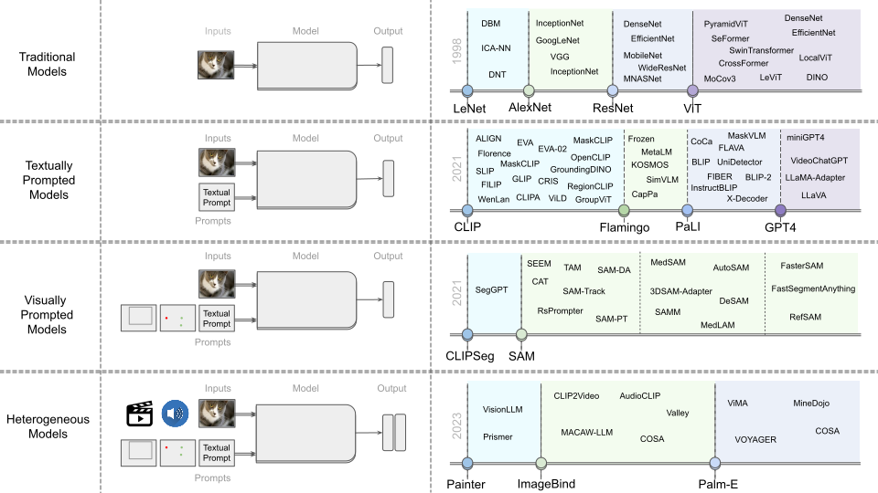

[](https://GitHub.com/Naereen/StrapDown.js/graphs/commit-activity)
[](http://makeapullrequest.com)
[](https://github.com/sindresorhus/awesome)

# Foundational Models Defining a New Era in Vision: A Survey and Outlook

> [**Foundational Models Defining a New Era in Vision: A Survey and Outlook**](https://arxiv.org/abs/2307.13721)<br>
> [Muhammad Awais](awaisrauf.github.io), [Muzammal Naseer](https://muzammal-naseer.netlify.app), [Salman Khan](https://salman-h-khan.github.io), [Rao Muhammad Anwer](https://scholar.google.fi/citations?user=_KlvMVoAAAAJ&hl=en), [Hisham Cholakkal](https://scholar.google.com/citations?user=bZ3YBRcAAAAJ&hl=en), [Mubarak Shah](https://www.crcv.ucf.edu/person/mubarak-shah/), [ Ming-Hsuan Yang](http://faculty.ucmerced.edu/mhyang/), [Fahad Shahbaz Khan](https://sites.google.com/view/fahadkhans/home)

> **<p align="justify"> Abstract:** *Vision systems to see and reason about the compositional nature of visual scenes are fundamental to understanding our
world. The complex relations between objects and their locations, ambiguities, and variations in the real-world environment can be
better described in human language, naturally governed by grammatical rules and other modalities such as audio and depth. The
models learned to bridge the gap between such modalities coupled with large-scale training data facilitate contextual reasoning,
generalization, and prompt capabilities at test time. These models are referred to as foundational models. The output of such models
can be modified through human-provided prompts without retraining, e.g., segmenting a particular object by providing a bounding box,
having interactive dialogues by asking questions about an image or video scene or manipulating the robot’s behavior through language
instructions. In this survey, we provide a comprehensive review of such emerging foundational models, including typical architecture
designs to combine different modalities (vision, text, audio, etc), training objectives (contrastive, generative), pre-training datasets,
fine-tuning mechanisms, and the common prompting patterns; textual, visual, and heterogeneous. We discuss the open challenges
and research directions for foundational models in computer vision, including difficulties in their evaluations and benchmarking, gaps in
their real-world understanding, limitations of their contextual understanding, biases, vulnerability to adversarial attacks, and
interpretability issues. We review recent developments in this field, covering a wide range of applications of foundation models
systematically and comprehensively.* </p>


<div align='center'>

</div>


# <p align=center>`Awesome CV Foundational Models`</p>

A curated list of awesome foundational models in computer vision. This repo supplements our survey paper. We intend to continuously update it.

We strongly encourage authors of relevant works to make a pull request and add their paper's information.

____

## Citation

If you find our work useful in your research, please consider citing:
```
@article{awais2023foundational,
  title={Foundational Models Defining a New Era in Vision: A Survey and Outlook},
  author={Awais, Muhammad and Naseer, Muzammal and Khan, Salman and Anwer, Rao Muhammad and Cholakkal, Hisham and Shah, Mubarak and Yang, Ming-Hsuan and Khan, Fahad Shahbaz},
  journal={arXiv preprint arXiv:2307.13721},
  year={2023}
}
```
# Menu

- [Surveys](#surveys)
- [Year 2021](#2021)
- [Year 2022](#2022)
- [Year 2023](#2023)

# Surveys

[**Foundational Models Defining a New Era in Vision: A Survey and Outlook**](https://arxiv.org/pdf/2307.13721.pdf) 2023 <br>
[Muhammad Awais](awaisrauf.github.io), [Muzammal Naseer](https://muzammal-naseer.netlify.app), [Salman Khan](https://salman-h-khan.github.io), [Rao Muhammad Anwer](https://scholar.google.fi/citations?user=_KlvMVoAAAAJ&hl=en), [Hisham Cholakkal](https://scholar.google.com/citations?user=bZ3YBRcAAAAJ&hl=en), [Mubarak Shah](https://www.crcv.ucf.edu/person/mubarak-shah/),[ Ming-Hsuan Yang](http://faculty.ucmerced.edu/mhyang/), [Fahad Shahbaz Khan](https://sites.google.com/view/fahadkhans/home) <br>
[[PDF]](https://arxiv.org/pdf/2307.13721.pdf)

[**A  of Large Language Models**](https://arxiv.org/abs/2303.18223) 2023 <br>
Wayne Xin Zhao and Kun Zhou and  Junyi Li and  Tianyi Tang and  Xiaolei Wang and  Yupeng Hou and Yingqian Min and Beichen Zhang and  Junjie Zhang and  Zican Dong and  Yifan Du and  Chen Yang and  Yushuo Chen and  Zhipeng Chen and  Jinhao Jiang and  Ruiyang Ren and  Yifan Li and  Xinyu Tang and  Zikang Liu and  Peiyu Liu and  Jian-Yun Nie and  Ji-Rong Wen <br>
[[PDF]](https://arxiv.org/pdf/2303.18223)

[**Harnessing the Power of LLMs in Practice: A Survey on ChatGPT and Beyond**](https://arxiv.org/abs/2304.13712) 2023 <br>
Jingfeng Yang and Hongye Jin and Ruixiang Tang and Xiaotian Han and Qizhang Feng and Haoming Jiang and Bing Yin and Xia Hu <br>
[[PDF]](https://arxiv.org/pdf/2304.13712)

[**Multimodal Learning with Transformers: A Survey**](https://arxiv.org/abs/2206.06488) 2023 <br>
Peng Xu and Xiatian Zhu and David Clifton <br>
[[PDF]](https://arxiv.org/pdf/2206.06488)

[**Self-Supervised Multimodal Learning: A Survey**](https://arxiv.org/abs/2304.01008) <br>
Yongshuo Zong and Oisin Mac Aodha and Timothy Hospedales <br>
[[PDF]](https://arxiv.org/pdf/2304.01008)

[**Vision-and-Language Pretrained Models: A Survey**](https://www.ijcai.org/proceedings/2022/0773.pdf) 2022 <br>
Siqu Long and Feiqi Cao and Soyeon Caren Han and Haiqin Yang <br>
[[PDF]](https://www.ijcai.org/proceedings/2022/0773.pdf)

[**A Survey of Vision-Language Pre-Trained Models**](https://arxiv.org/abs/2204.07356) 2022 <br>
Yifan Du and Zikang Liu and Junyi Li and Wayne Xin Zhao <br>
[[PDF]](https://arxiv.org/pdf/2204.07356)

[**Vision-Language Models for Vision Tasks: A Survey**](https://arxiv.org/abs/2304.00685) 2022 <br>
Jingyi, Zhang and Jiaxing, Huang and Sheng, Jin and Shijian, Lu <br>
[[PDF]](https://arxiv.org/pdf/2304.00685)

[**A Comprehensive Survey on Segment Anything Model for Vision and Beyond**](https://arxiv.org/abs/2305.08196) 2023 <br>
Chunhui Zhang and Li Liu and Yawen Cui and Guanjie Huang and Weilin Lin and Yiqian Yang and Yuehong Hu <br>
[[PDF]](https://arxiv.org/pdf/2305.08196)

[**Vision-language pre-training: Basics, recent advances, and future trends**](https://arxiv.org/abs/2210.09263) 2022 <br>
Gan, Zhe and Li, Linjie and Li, Chunyuan and Wang, Lijuan and Liu, Zicheng and Gao, Jianfeng and others <br>
[[PDF]](https://arxiv.org/pdf/2210.09263)

[**Towards Open Vocabulary Learning: A Survey**](https://arxiv.org/abs/2306.15880) 2023 <br>
Jianzong Wu, Xiangtai Li, Shilin Xu, Haobo Yuan, Henghui Ding, Yibo Yang, Xia Li, Jiangning Zhang, Yunhai Tong, Xudong Jiang, Bernard Ghanem, Dacheng Tao <br>
[[PDF]](https://arxiv.org/pdf/2306.15880)

[**Transformer-Based Visual Segmentation: A Survey**](https://arxiv.org/abs/2304.09854) 2023 <br>
Xiangtai Li, Henghui Ding, Wenwei Zhang, Haobo Yuan, Jiangmiao Pang, Guangliang Cheng, Kai Chen, Ziwei Liu, Chen Change Loy 
[[PDF]](https://arxiv.org/pdf/2304.09854)

____

# Papers

## 2021

**Scaling Up Visual and Vision-Language Representation Learning With Noisy Text Supervision**  2021-02-11 <br> Jia, Chao,  Yang, Yinfei,  Xia, Ye,  Chen, Yi-Ting,  Parekh, Zarana,  Pham, Hieu,  Le, Quoc,  Sung, Yun-Hsuan,  Li, Zhen,  Duerig, Tom <br>  [[Paper Link]](http://arxiv.org/pdf/2102.05918v2) <br> <details><summary>Read Abstract</summary>Pre-trained representations are becoming crucial for many NLP and perception
tasks. While representation learning in NLP has transitioned to training on raw
text without human annotations, visual and vision-language representations
still rely heavily on curated training datasets that are expensive or require
expert knowledge. For vision applications, representations are mostly learned
using datasets with explicit class labels such as ImageNet or OpenImages. For
vision-language, popular datasets like Conceptual Captions, MSCOCO, or CLIP all
involve a non-trivial data collection (and cleaning) process. This costly
curation process limits the size of datasets and hence hinders the scaling of
trained models. In this paper, we leverage a noisy dataset of over one billion
image alt-text pairs, obtained without expensive filtering or post-processing
steps in the Conceptual Captions dataset. A simple dual-encoder architecture
learns to align visual and language representations of the image and text pairs
using a contrastive loss. We show that the scale of our corpus can make up for
its noise and leads to state-of-the-art representations even with such a simple
learning scheme. Our visual representation achieves strong performance when
transferred to classification tasks such as ImageNet and VTAB. The aligned
visual and language representations enables zero-shot image classification and
also set new state-of-the-art results on Flickr30K and MSCOCO image-text
retrieval benchmarks, even when compared with more sophisticated
cross-attention models. The representations also enable cross-modality search
with complex text and text + image queries.</details> 
 
**Learning Transferable Visual Models From Natural Language Supervision**  2021-02-26 <br> Radford, Alec,  Kim, Jong Wook,  Hallacy, Chris,  Ramesh, Aditya,  Goh, Gabriel,  Agarwal, Sandhini,  Sastry, Girish,  Askell, Amanda,  Mishkin, Pamela,  Clark, Jack,  others <br>  [[Paper Link]](http://arxiv.org/pdf/2103.00020v1) [[Code]](https://github.com/OpenAI/CLIP) <br> <details><summary>Read Abstract</summary>State-of-the-art computer vision systems are trained to predict a fixed set
of predetermined object categories. This restricted form of supervision limits
their generality and usability since additional labeled data is needed to
specify any other visual concept. Learning directly from raw text about images
is a promising alternative which leverages a much broader source of
supervision. We demonstrate that the simple pre-training task of predicting
which caption goes with which image is an efficient and scalable way to learn
SOTA image representations from scratch on a dataset of 400 million (image,
text) pairs collected from the internet. After pre-training, natural language
is used to reference learned visual concepts (or describe new ones) enabling
zero-shot transfer of the model to downstream tasks. We study the performance
of this approach by benchmarking on over 30 different existing computer vision
datasets, spanning tasks such as OCR, action recognition in videos,
geo-localization, and many types of fine-grained object classification. The
model transfers non-trivially to most tasks and is often competitive with a
fully supervised baseline without the need for any dataset specific training.
For instance, we match the accuracy of the original ResNet-50 on ImageNet
zero-shot without needing to use any of the 1.28 million training examples it
was trained on. We release our code and pre-trained model weights at
https://github.com/OpenAI/CLIP.</details> 
 
**WenLan: Bridging Vision and Language by Large-Scale Multi-Modal Pre-Training**  2021-03-11 <br> Huo, Yuqi,  Zhang, Manli,  Liu, Guangzhen,  Lu, Haoyu,  Gao, Yizhao,  Yang, Guoxing,  Wen, Jingyuan,  Zhang, Heng,  Xu, Baogui,  Zheng, Weihao,  others <br>  [[Paper Link]](http://arxiv.org/pdf/2103.06561v6) <br> <details><summary>Read Abstract</summary>Multi-modal pre-training models have been intensively explored to bridge
vision and language in recent years. However, most of them explicitly model the
cross-modal interaction between image-text pairs, by assuming that there exists
strong semantic correlation between the text and image modalities. Since this
strong assumption is often invalid in real-world scenarios, we choose to
implicitly model the cross-modal correlation for large-scale multi-modal
pre-training, which is the focus of the Chinese project `WenLan' led by our
team. Specifically, with the weak correlation assumption over image-text pairs,
we propose a two-tower pre-training model called BriVL within the cross-modal
contrastive learning framework. Unlike OpenAI CLIP that adopts a simple
contrastive learning method, we devise a more advanced algorithm by adapting
the latest method MoCo into the cross-modal scenario. By building a large
queue-based dictionary, our BriVL can incorporate more negative samples in
limited GPU resources. We further construct a large Chinese multi-source
image-text dataset called RUC-CAS-WenLan for pre-training our BriVL model.
Extensive experiments demonstrate that the pre-trained BriVL model outperforms
both UNITER and OpenAI CLIP on various downstream tasks.</details> 
 
**Open-vocabulary Object Detection via Vision and Language Knowledge Distillation**  2021-04-28 <br> Gu, Xiuye,  Lin, Tsung-Yi,  Kuo, Weicheng,  Cui, Yin <br>  [[Paper Link]](http://arxiv.org/pdf/2104.13921v3) [[Code]](https://github.com/tensorflow/tpu) <br> <details><summary>Read Abstract</summary>We aim at advancing open-vocabulary object detection, which detects objects
described by arbitrary text inputs. The fundamental challenge is the
availability of training data. It is costly to further scale up the number of
classes contained in existing object detection datasets. To overcome this
challenge, we propose ViLD, a training method via Vision and Language knowledge
Distillation. Our method distills the knowledge from a pretrained
open-vocabulary image classification model (teacher) into a two-stage detector
(student). Specifically, we use the teacher model to encode category texts and
image regions of object proposals. Then we train a student detector, whose
region embeddings of detected boxes are aligned with the text and image
embeddings inferred by the teacher. We benchmark on LVIS by holding out all
rare categories as novel categories that are not seen during training. ViLD
obtains 16.1 mask AP$_r$ with a ResNet-50 backbone, even outperforming the
supervised counterpart by 3.8. When trained with a stronger teacher model
ALIGN, ViLD achieves 26.3 AP$_r$. The model can directly transfer to other
datasets without finetuning, achieving 72.2 AP$_{50}$ on PASCAL VOC, 36.6 AP on
COCO and 11.8 AP on Objects365. On COCO, ViLD outperforms the previous
state-of-the-art by 4.8 on novel AP and 11.4 on overall AP. Code and demo are
open-sourced at
https://github.com/tensorflow/tpu/tree/master/models/official/detection/projects/vild.</details> 
 
**CLIP2Video: Mastering Video-Text Retrieval via Image CLIP**  2021-06-21 <br> Han Fang,  Pengfei Xiong,  Luhui Xu,  Yu Chen <br>  [[Paper Link]](http://arxiv.org/pdf/2106.11097v1) <br> <details><summary>Read Abstract</summary>We present CLIP2Video network to transfer the image-language pre-training
model to video-text retrieval in an end-to-end manner. Leading approaches in
the domain of video-and-language learning try to distill the spatio-temporal
video features and multi-modal interaction between videos and languages from a
large-scale video-text dataset. Different from them, we leverage pretrained
image-language model, simplify it as a two-stage framework with co-learning of
image-text and enhancing temporal relations between video frames and video-text
respectively, make it able to train on comparatively small datasets.
Specifically, based on the spatial semantics captured by Contrastive
Language-Image Pretraining (CLIP) model, our model involves a Temporal
Difference Block to capture motions at fine temporal video frames, and a
Temporal Alignment Block to re-align the tokens of video clips and phrases and
enhance the multi-modal correlation. We conduct thorough ablation studies, and
achieve state-of-the-art performance on major text-to-video and video-to-text
retrieval benchmarks, including new records of retrieval accuracy on MSR-VTT,
MSVD and VATEX.</details> 
 
**AudioCLIP: Extending CLIP to Image, Text and Audio**  2021-06-24 <br> Andrey Guzhov,  Federico Raue,  Jörn Hees,  Andreas Dengel <br>  [[Paper Link]](http://arxiv.org/pdf/2106.13043v1) <br> <details><summary>Read Abstract</summary>In the past, the rapidly evolving field of sound classification greatly
benefited from the application of methods from other domains. Today, we observe
the trend to fuse domain-specific tasks and approaches together, which provides
the community with new outstanding models.
  In this work, we present an extension of the CLIP model that handles audio in
addition to text and images. Our proposed model incorporates the ESResNeXt
audio-model into the CLIP framework using the AudioSet dataset. Such a
combination enables the proposed model to perform bimodal and unimodal
classification and querying, while keeping CLIP's ability to generalize to
unseen datasets in a zero-shot inference fashion.
  AudioCLIP achieves new state-of-the-art results in the Environmental Sound
Classification (ESC) task, out-performing other approaches by reaching
accuracies of 90.07% on the UrbanSound8K and 97.15% on the ESC-50 datasets.
Further it sets new baselines in the zero-shot ESC-task on the same datasets
(68.78% and 69.40%, respectively).
  Finally, we also assess the cross-modal querying performance of the proposed
model as well as the influence of full and partial training on the results. For
the sake of reproducibility, our code is published.</details> 
 
**Multimodal Few-Shot Learning with Frozen Language Models**  2021-06-25 <br> Tsimpoukelli, Maria,  Menick, Jacob L,  Cabi, Serkan,  Eslami, SM,  Vinyals, Oriol,  Hill, Felix <br>  [[Paper Link]](http://arxiv.org/pdf/2106.13884v2) <br> <details><summary>Read Abstract</summary>When trained at sufficient scale, auto-regressive language models exhibit the
notable ability to learn a new language task after being prompted with just a
few examples. Here, we present a simple, yet effective, approach for
transferring this few-shot learning ability to a multimodal setting (vision and
language). Using aligned image and caption data, we train a vision encoder to
represent each image as a sequence of continuous embeddings, such that a
pre-trained, frozen language model prompted with this prefix generates the
appropriate caption. The resulting system is a multimodal few-shot learner,
with the surprising ability to learn a variety of new tasks when conditioned on
examples, represented as a sequence of multiple interleaved image and text
embeddings. We demonstrate that it can rapidly learn words for new objects and
novel visual categories, do visual question-answering with only a handful of
examples, and make use of outside knowledge, by measuring a single model on a
variety of established and new benchmarks.</details> 
 
**SimVLM: Simple Visual Language Model Pretraining with Weak Supervision**  2021-08-24 <br> Wang, Zirui,  Yu, Jiahui,  Yu, Adams Wei,  Dai, Zihang,  Tsvetkov, Yulia,  Cao, Yuan <br>  [[Paper Link]](http://arxiv.org/pdf/2108.10904v3) <br> <details><summary>Read Abstract</summary>With recent progress in joint modeling of visual and textual representations,
Vision-Language Pretraining (VLP) has achieved impressive performance on many
multimodal downstream tasks. However, the requirement for expensive annotations
including clean image captions and regional labels limits the scalability of
existing approaches, and complicates the pretraining procedure with the
introduction of multiple dataset-specific objectives. In this work, we relax
these constraints and present a minimalist pretraining framework, named Simple
Visual Language Model (SimVLM). Unlike prior work, SimVLM reduces the training
complexity by exploiting large-scale weak supervision, and is trained
end-to-end with a single prefix language modeling objective. Without utilizing
extra data or task-specific customization, the resulting model significantly
outperforms previous pretraining methods and achieves new state-of-the-art
results on a wide range of discriminative and generative vision-language
benchmarks, including VQA (+3.74% vqa-score), NLVR2 (+1.17% accuracy), SNLI-VE
(+1.37% accuracy) and image captioning tasks (+10.1% average CIDEr score).
Furthermore, we demonstrate that SimVLM acquires strong generalization and
transfer ability, enabling zero-shot behavior including open-ended visual
question answering and cross-modality transfer.</details> 
 
**LAION-400M: Open Dataset of CLIP-Filtered 400 Million Image-Text Pairs**  2021-11-03 <br> Schuhmann, Christoph,  Vencu, Richard,  Beaumont, Romain,  Kaczmarczyk, Robert,  Mullis, Clayton,  Katta, Aarush,  Coombes, Theo,  Jitsev, Jenia,  Komatsuzaki, Aran <br>  [[Paper Link]](http://arxiv.org/pdf/2111.02114v1) <br> <details><summary>Read Abstract</summary>Multi-modal language-vision models trained on hundreds of millions of
image-text pairs (e.g. CLIP, DALL-E) gained a recent surge, showing remarkable
capability to perform zero- or few-shot learning and transfer even in absence
of per-sample labels on target image data. Despite this trend, to date there
has been no publicly available datasets of sufficient scale for training such
models from scratch. To address this issue, in a community effort we build and
release for public LAION-400M, a dataset with CLIP-filtered 400 million
image-text pairs, their CLIP embeddings and kNN indices that allow efficient
similarity search.</details> 
 
**FILIP: Fine-grained Interactive Language-Image Pre-Training**  2021-11-09 <br> Yao, Lewei,  Huang, Runhui,  Hou, Lu,  Lu, Guansong,  Niu, Minzhe,  Xu, Hang,  Liang, Xiaodan,  Li, Zhenguo,  Jiang, Xin,  Xu, Chunjing <br>  [[Paper Link]](http://arxiv.org/pdf/2111.07783v1) <br> <details><summary>Read Abstract</summary>Unsupervised large-scale vision-language pre-training has shown promising
advances on various downstream tasks. Existing methods often model the
cross-modal interaction either via the similarity of the global feature of each
modality which misses sufficient information, or finer-grained interactions
using cross/self-attention upon visual and textual tokens. However,
cross/self-attention suffers from inferior efficiency in both training and
inference. In this paper, we introduce a large-scale Fine-grained Interactive
Language-Image Pre-training (FILIP) to achieve finer-level alignment through a
cross-modal late interaction mechanism, which uses a token-wise maximum
similarity between visual and textual tokens to guide the contrastive
objective. FILIP successfully leverages the finer-grained expressiveness
between image patches and textual words by modifying only contrastive loss,
while simultaneously gaining the ability to pre-compute image and text
representations offline at inference, keeping both large-scale training and
inference efficient. Furthermore, we construct a new large-scale image-text
pair dataset called FILIP300M for pre-training. Experiments show that FILIP
achieves state-of-the-art performance on multiple downstream vision-language
tasks including zero-shot image classification and image-text retrieval. The
visualization on word-patch alignment further shows that FILIP can learn
meaningful fine-grained features with promising localization ability.</details> 
 
**Florence: A New Foundation Model for Computer Vision**  2021-11-22 <br> Yuan, Lu,  Chen, Dongdong,  Chen, Yi-Ling,  Codella, Noel,  Dai, Xiyang,  Gao, Jianfeng,  Hu, Houdong,  Huang, Xuedong,  Li, Boxin,  Li, Chunyuan,  others <br>  [[Paper Link]](http://arxiv.org/pdf/2111.11432v1) <br> <details><summary>Read Abstract</summary>Automated visual understanding of our diverse and open world demands computer
vision models to generalize well with minimal customization for specific tasks,
similar to human vision. Computer vision foundation models, which are trained
on diverse, large-scale dataset and can be adapted to a wide range of
downstream tasks, are critical for this mission to solve real-world computer
vision applications. While existing vision foundation models such as CLIP,
ALIGN, and Wu Dao 2.0 focus mainly on mapping images and textual
representations to a cross-modal shared representation, we introduce a new
computer vision foundation model, Florence, to expand the representations from
coarse (scene) to fine (object), from static (images) to dynamic (videos), and
from RGB to multiple modalities (caption, depth). By incorporating universal
visual-language representations from Web-scale image-text data, our Florence
model can be easily adapted for various computer vision tasks, such as
classification, retrieval, object detection, VQA, image caption, video
retrieval and action recognition. Moreover, Florence demonstrates outstanding
performance in many types of transfer learning: fully sampled fine-tuning,
linear probing, few-shot transfer and zero-shot transfer for novel images and
objects. All of these properties are critical for our vision foundation model
to serve general purpose vision tasks. Florence achieves new state-of-the-art
results in majority of 44 representative benchmarks, e.g., ImageNet-1K
zero-shot classification with top-1 accuracy of 83.74 and the top-5 accuracy of
97.18, 62.4 mAP on COCO fine tuning, 80.36 on VQA, and 87.8 on Kinetics-600.</details> 
 
## 2022

**Extract Free Dense Labels from CLIP**  2021-12-02 <br> Zhou, Chong,  Loy, Chen Change,  Dai, Bo <br>  [[Paper Link]](http://arxiv.org/pdf/2112.01071v2) [[Code]](https://github.com/chongzhou96/MaskCLIP) <br> <details><summary>Read Abstract</summary>Contrastive Language-Image Pre-training (CLIP) has made a remarkable
breakthrough in open-vocabulary zero-shot image recognition. Many recent
studies leverage the pre-trained CLIP models for image-level classification and
manipulation. In this paper, we wish examine the intrinsic potential of CLIP
for pixel-level dense prediction, specifically in semantic segmentation. To
this end, with minimal modification, we show that MaskCLIP yields compelling
segmentation results on open concepts across various datasets in the absence of
annotations and fine-tuning. By adding pseudo labeling and self-training,
MaskCLIP+ surpasses SOTA transductive zero-shot semantic segmentation methods
by large margins, e.g., mIoUs of unseen classes on PASCAL VOC/PASCAL
Context/COCO Stuff are improved from 35.6/20.7/30.3 to 86.1/66.7/54.7. We also
test the robustness of MaskCLIP under input corruption and evaluate its
capability in discriminating fine-grained objects and novel concepts. Our
finding suggests that MaskCLIP can serve as a new reliable source of
supervision for dense prediction tasks to achieve annotation-free segmentation.
Source code is available at https://github.com/chongzhou96/MaskCLIP.</details> 
 
**FLAVA: A Foundational Language And Vision Alignment Model**  2021-12-08 <br> Singh, Amanpreet,  Hu, Ronghang,  Goswami, Vedanuj,  Couairon, Guillaume,  Galuba, Wojciech,  Rohrbach, Marcus,  Kiela, Douwe <br>  [[Paper Link]](http://arxiv.org/pdf/2112.04482v3) <br> <details><summary>Read Abstract</summary>State-of-the-art vision and vision-and-language models rely on large-scale
visio-linguistic pretraining for obtaining good performance on a variety of
downstream tasks. Generally, such models are often either cross-modal
(contrastive) or multi-modal (with earlier fusion) but not both; and they often
only target specific modalities or tasks. A promising direction would be to use
a single holistic universal model, as a "foundation", that targets all
modalities at once -- a true vision and language foundation model should be
good at vision tasks, language tasks, and cross- and multi-modal vision and
language tasks. We introduce FLAVA as such a model and demonstrate impressive
performance on a wide range of 35 tasks spanning these target modalities.</details> 
 
**Image Segmentation Using Text and Image Prompts**  2021-12-18 <br> L{\"u}ddecke, Timo,  Ecker, Alexander <br>  [[Paper Link]](http://arxiv.org/pdf/2112.10003v2) [[Website]](https://eckerlab.org/code/clipseg.) <br> <details><summary>Read Abstract</summary>Image segmentation is usually addressed by training a model for a fixed set
of object classes. Incorporating additional classes or more complex queries
later is expensive as it requires re-training the model on a dataset that
encompasses these expressions. Here we propose a system that can generate image
segmentations based on arbitrary prompts at test time. A prompt can be either a
text or an image. This approach enables us to create a unified model (trained
once) for three common segmentation tasks, which come with distinct challenges:
referring expression segmentation, zero-shot segmentation and one-shot
segmentation. We build upon the CLIP model as a backbone which we extend with a
transformer-based decoder that enables dense prediction. After training on an
extended version of the PhraseCut dataset, our system generates a binary
segmentation map for an image based on a free-text prompt or on an additional
image expressing the query. We analyze different variants of the latter
image-based prompts in detail. This novel hybrid input allows for dynamic
adaptation not only to the three segmentation tasks mentioned above, but to any
binary segmentation task where a text or image query can be formulated.
Finally, we find our system to adapt well to generalized queries involving
affordances or properties. Code is available at
https://eckerlab.org/code/clipseg.</details> 
 
**Scaling Open-Vocabulary Image Segmentation with Image-Level Labels**  2021-12-22 <br> Golnaz Ghiasi,  Xiuye Gu,  Yin Cui,  Tsung-Yi Lin <br>  [[Paper Link]](http://arxiv.org/pdf/2112.12143v2) <br> <details><summary>Read Abstract</summary>We design an open-vocabulary image segmentation model to organize an image
into meaningful regions indicated by arbitrary texts. Recent works (CLIP and
ALIGN), despite attaining impressive open-vocabulary classification accuracy
with image-level caption labels, are unable to segment visual concepts with
pixels. We argue that these models miss an important step of visual grouping,
which organizes pixels into groups before learning visual-semantic alignments.
We propose OpenSeg to address the above issue while still making use of
scalable image-level supervision of captions. First, it learns to propose
segmentation masks for possible organizations. Then it learns visual-semantic
alignments by aligning each word in a caption to one or a few predicted masks.
We find the mask representations are the key to support learning image
segmentation from captions, making it possible to scale up the dataset and
vocabulary sizes. OpenSeg significantly outperforms the recent open-vocabulary
method of LSeg by +19.9 mIoU on PASCAL dataset, thanks to its scalability.</details> 
 
**GroupViT: Semantic Segmentation Emerges from Text Supervision**  2022-02-22 <br> Jiarui Xu,  Shalini De Mello,  Sifei Liu,  Wonmin Byeon,  Thomas Breuel,  J. Kautz,  X. Wang <br>  [[Paper Link]](http://arxiv.org/pdf/2202.11094v5) [[Code]](https://github.com/NVlabs/GroupViT) <br> <details><summary>Read Abstract</summary>Grouping and recognition are important components of visual scene
understanding, e.g., for object detection and semantic segmentation. With
end-to-end deep learning systems, grouping of image regions usually happens
implicitly via top-down supervision from pixel-level recognition labels.
Instead, in this paper, we propose to bring back the grouping mechanism into
deep networks, which allows semantic segments to emerge automatically with only
text supervision. We propose a hierarchical Grouping Vision Transformer
(GroupViT), which goes beyond the regular grid structure representation and
learns to group image regions into progressively larger arbitrary-shaped
segments. We train GroupViT jointly with a text encoder on a large-scale
image-text dataset via contrastive losses. With only text supervision and
without any pixel-level annotations, GroupViT learns to group together semantic
regions and successfully transfers to the task of semantic segmentation in a
zero-shot manner, i.e., without any further fine-tuning. It achieves a
zero-shot accuracy of 52.3% mIoU on the PASCAL VOC 2012 and 22.4% mIoU on
PASCAL Context datasets, and performs competitively to state-of-the-art
transfer-learning methods requiring greater levels of supervision. We
open-source our code at https://github.com/NVlabs/GroupViT .</details> 
 
**CoCa: Contrastive Captioners are Image-Text Foundation Models**  2022-05-04 <br> Yu, Jiahui,  Wang, Zirui,  Vasudevan, Vijay,  Yeung, Legg,  Seyedhosseini, Mojtaba,  Wu, Yonghui <br>  [[Paper Link]](http://arxiv.org/pdf/2205.01917v2) <br> <details><summary>Read Abstract</summary>Exploring large-scale pretrained foundation models is of significant interest
in computer vision because these models can be quickly transferred to many
downstream tasks. This paper presents Contrastive Captioner (CoCa), a
minimalist design to pretrain an image-text encoder-decoder foundation model
jointly with contrastive loss and captioning loss, thereby subsuming model
capabilities from contrastive approaches like CLIP and generative methods like
SimVLM. In contrast to standard encoder-decoder transformers where all decoder
layers attend to encoder outputs, CoCa omits cross-attention in the first half
of decoder layers to encode unimodal text representations, and cascades the
remaining decoder layers which cross-attend to the image encoder for multimodal
image-text representations. We apply a contrastive loss between unimodal image
and text embeddings, in addition to a captioning loss on the multimodal decoder
outputs which predicts text tokens autoregressively. By sharing the same
computational graph, the two training objectives are computed efficiently with
minimal overhead. CoCa is pretrained end-to-end and from scratch on both
web-scale alt-text data and annotated images by treating all labels simply as
text, seamlessly unifying natural language supervision for representation
learning. Empirically, CoCa achieves state-of-the-art performance with
zero-shot transfer or minimal task-specific adaptation on a broad range of
downstream tasks, spanning visual recognition (ImageNet, Kinetics-400/600/700,
Moments-in-Time), crossmodal retrieval (MSCOCO, Flickr30K, MSR-VTT), multimodal
understanding (VQA, SNLI-VE, NLVR2), and image captioning (MSCOCO, NoCaps).
Notably on ImageNet classification, CoCa obtains 86.3% zero-shot top-1
accuracy, 90.6% with a frozen encoder and learned classification head, and new
state-of-the-art 91.0% top-1 accuracy on ImageNet with a finetuned encoder.</details> 
 
**Simple Open-Vocabulary Object Detection with Vision Transformers**  2022-05-12 <br> Matthias Minderer,  Alexey Gritsenko,  Austin Stone,  Maxim Neumann,  Dirk Weissenborn,  Alexey Dosovitskiy,  Aravindh Mahendran,  Anurag Arnab,  Mostafa Dehghani,  Zhuoran Shen,  Xiao Wang,  Xiaohua Zhai,  Thomas Kipf,  Neil Houlsby <br>  [[Paper Link]](http://arxiv.org/pdf/2205.06230v2) <br> <details><summary>Read Abstract</summary>Combining simple architectures with large-scale pre-training has led to
massive improvements in image classification. For object detection,
pre-training and scaling approaches are less well established, especially in
the long-tailed and open-vocabulary setting, where training data is relatively
scarce. In this paper, we propose a strong recipe for transferring image-text
models to open-vocabulary object detection. We use a standard Vision
Transformer architecture with minimal modifications, contrastive image-text
pre-training, and end-to-end detection fine-tuning. Our analysis of the scaling
properties of this setup shows that increasing image-level pre-training and
model size yield consistent improvements on the downstream detection task. We
provide the adaptation strategies and regularizations needed to attain very
strong performance on zero-shot text-conditioned and one-shot image-conditioned
object detection. Code and models are available on GitHub.</details> 
 
**GIT: A Generative Image-to-text Transformer for Vision and Language**  2022-05-27 <br> Wang, Jianfeng,  Yang, Zhengyuan,  Hu, Xiaowei,  Li, Linjie,  Lin, Kevin,  Gan, Zhe,  Liu, Zicheng,  Liu, Ce,  Wang, Lijuan <br>  [[Paper Link]](http://arxiv.org/pdf/2205.14100v5) [[Code]](https://github.com/microsoft/GenerativeImage2Text) <br> <details><summary>Read Abstract</summary>In this paper, we design and train a Generative Image-to-text Transformer,
GIT, to unify vision-language tasks such as image/video captioning and question
answering. While generative models provide a consistent network architecture
between pre-training and fine-tuning, existing work typically contains complex
structures (uni/multi-modal encoder/decoder) and depends on external modules
such as object detectors/taggers and optical character recognition (OCR). In
GIT, we simplify the architecture as one image encoder and one text decoder
under a single language modeling task. We also scale up the pre-training data
and the model size to boost the model performance. Without bells and whistles,
our GIT establishes new state of the arts on 12 challenging benchmarks with a
large margin. For instance, our model surpasses the human performance for the
first time on TextCaps (138.2 vs. 125.5 in CIDEr). Furthermore, we present a
new scheme of generation-based image classification and scene text recognition,
achieving decent performance on standard benchmarks. Codes are released at
\url{https://github.com/microsoft/GenerativeImage2Text}.</details> 
 
**Language Models are General-Purpose Interfaces**  2022-06-13 <br> Yaru Hao,  Haoyu Song,  Li Dong,  Shaohan Huang,  Zewen Chi,  Wenhui Wang,  Shuming Ma,  Furu Wei <br>  [[Paper Link]](http://arxiv.org/pdf/2206.06336v1) <br> <details><summary>Read Abstract</summary>Foundation models have received much attention due to their effectiveness
across a broad range of downstream applications. Though there is a big
convergence in terms of architecture, most pretrained models are typically
still developed for specific tasks or modalities. In this work, we propose to
use language models as a general-purpose interface to various foundation
models. A collection of pretrained encoders perceive diverse modalities (such
as vision, and language), and they dock with a language model that plays the
role of a universal task layer. We propose a semi-causal language modeling
objective to jointly pretrain the interface and the modular encoders. We
subsume the advantages and capabilities from both causal and non-causal
modeling, thereby combining the best of two worlds. Specifically, the proposed
method not only inherits the capabilities of in-context learning and open-ended
generation from causal language modeling, but also is conducive to finetuning
because of the bidirectional encoders. More importantly, our approach
seamlessly unlocks the combinations of the above capabilities, e.g., enabling
in-context learning or instruction following with finetuned encoders.
Experimental results across various language-only and vision-language
benchmarks show that our model outperforms or is competitive with specialized
models on finetuning, zero-shot generalization, and few-shot learning.</details> 
 
**Coarse-to-Fine Vision-Language Pre-training with Fusion in the Backbone**  2022-06-15 <br> Dou, Zi-Yi,  Kamath, Aishwarya,  Gan, Zhe,  Zhang, Pengchuan,  Wang, Jianfeng,  Li, Linjie,  Liu, Zicheng,  Liu, Ce,  LeCun, Yann,  Peng, Nanyun,  others <br>  [[Paper Link]](http://arxiv.org/pdf/2206.07643v2) [[Code]](https://github.com/microsoft/FIBER) <br> <details><summary>Read Abstract</summary>Vision-language (VL) pre-training has recently received considerable
attention. However, most existing end-to-end pre-training approaches either
only aim to tackle VL tasks such as image-text retrieval, visual question
answering (VQA) and image captioning that test high-level understanding of
images, or only target region-level understanding for tasks such as phrase
grounding and object detection. We present FIBER (Fusion-In-the-Backbone-based
transformER), a new VL model architecture that can seamlessly handle both these
types of tasks. Instead of having dedicated transformer layers for fusion after
the uni-modal backbones, FIBER pushes multimodal fusion deep into the model by
inserting cross-attention into the image and text backbones, bringing gains in
terms of memory and performance. In addition, unlike previous work that is
either only pre-trained on image-text data or on fine-grained data with
box-level annotations, we present a two-stage pre-training strategy that uses
both these kinds of data efficiently: (i) coarse-grained pre-training based on
image-text data; followed by (ii) fine-grained pre-training based on
image-text-box data. We conduct comprehensive experiments on a wide range of VL
tasks, ranging from VQA, image captioning, and retrieval, to phrase grounding,
referring expression comprehension, and object detection. Using deep multimodal
fusion coupled with the two-stage pre-training, FIBER provides consistent
performance improvements over strong baselines across all tasks, often
outperforming methods using magnitudes more data. Code is available at
https://github.com/microsoft/FIBER.</details> 
 
**A Unified Sequence Interface for Vision Tasks**  2022-06-15 <br> Chen, Ting,  Saxena, Saurabh,  Li, Lala,  Lin, Tsung-Yi,  Fleet, David J,  Hinton, Geoffrey E <br>  [[Paper Link]](http://arxiv.org/pdf/2206.07669v2) <br> <details><summary>Read Abstract</summary>While language tasks are naturally expressed in a single, unified, modeling
framework, i.e., generating sequences of tokens, this has not been the case in
computer vision. As a result, there is a proliferation of distinct
architectures and loss functions for different vision tasks. In this work we
show that a diverse set of "core" computer vision tasks can also be unified if
formulated in terms of a shared pixel-to-sequence interface. We focus on four
tasks, namely, object detection, instance segmentation, keypoint detection, and
image captioning, all with diverse types of outputs, e.g., bounding boxes or
dense masks. Despite that, by formulating the output of each task as a sequence
of discrete tokens with a unified interface, we show that one can train a
neural network with a single model architecture and loss function on all these
tasks, with no task-specific customization. To solve a specific task, we use a
short prompt as task description, and the sequence output adapts to the prompt
so it can produce task-specific output. We show that such a model can achieve
competitive performance compared to well-established task-specific models.</details> 
 
**BridgeTower: Building Bridges Between Encoders in Vision-Language Representation Learning**  2022-06-17 <br> Xu, Xiao,  Wu, Chenfei,  Rosenman, Shachar,  Lal, Vasudev,  Duan, Nan <br>  [[Paper Link]](http://arxiv.org/pdf/2206.08657v5) [[Code]](https://github.com/microsoft/BridgeTower) <br> <details><summary>Read Abstract</summary>Vision-Language (VL) models with the Two-Tower architecture have dominated
visual-language representation learning in recent years. Current VL models
either use lightweight uni-modal encoders and learn to extract, align and fuse
both modalities simultaneously in a deep cross-modal encoder, or feed the
last-layer uni-modal representations from the deep pre-trained uni-modal
encoders into the top cross-modal encoder. Both approaches potentially restrict
vision-language representation learning and limit model performance. In this
paper, we propose BridgeTower, which introduces multiple bridge layers that
build a connection between the top layers of uni-modal encoders and each layer
of the cross-modal encoder. This enables effective bottom-up cross-modal
alignment and fusion between visual and textual representations of different
semantic levels of pre-trained uni-modal encoders in the cross-modal encoder.
Pre-trained with only 4M images, BridgeTower achieves state-of-the-art
performance on various downstream vision-language tasks. In particular, on the
VQAv2 test-std set, BridgeTower achieves an accuracy of 78.73%, outperforming
the previous state-of-the-art model METER by 1.09% with the same pre-training
data and almost negligible additional parameters and computational costs.
Notably, when further scaling the model, BridgeTower achieves an accuracy of
81.15%, surpassing models that are pre-trained on orders-of-magnitude larger
datasets. Code and checkpoints are available at
https://github.com/microsoft/BridgeTower.</details> 
 
**MineDojo: Building Open-Ended Embodied Agents with Internet-Scale Knowledge**  2022-06-17 <br> Linxi Fan,  Guanzhi Wang,  Yunfan Jiang,  Ajay Mandlekar,  Yuncong Yang,  Haoyi Zhu,  Andrew Tang,  De-An Huang,  Yuke Zhu,  Anima Anandkumar <br>  [[Paper Link]](http://arxiv.org/pdf/2206.08853v2) [[Website]](https://minedojo.org)) <br> <details><summary>Read Abstract</summary>Autonomous agents have made great strides in specialist domains like Atari
games and Go. However, they typically learn tabula rasa in isolated
environments with limited and manually conceived objectives, thus failing to
generalize across a wide spectrum of tasks and capabilities. Inspired by how
humans continually learn and adapt in the open world, we advocate a trinity of
ingredients for building generalist agents: 1) an environment that supports a
multitude of tasks and goals, 2) a large-scale database of multimodal
knowledge, and 3) a flexible and scalable agent architecture. We introduce
MineDojo, a new framework built on the popular Minecraft game that features a
simulation suite with thousands of diverse open-ended tasks and an
internet-scale knowledge base with Minecraft videos, tutorials, wiki pages, and
forum discussions. Using MineDojo's data, we propose a novel agent learning
algorithm that leverages large pre-trained video-language models as a learned
reward function. Our agent is able to solve a variety of open-ended tasks
specified in free-form language without any manually designed dense shaping
reward. We open-source the simulation suite, knowledge bases, algorithm
implementation, and pretrained models (https://minedojo.org) to promote
research towards the goal of generally capable embodied agents.</details> 
 
**LM-Nav: Robotic Navigation with Large Pre-Trained Models of Language, Vision, and Action**  2022-07-10 <br> Dhruv Shah,  Blazej Osinski,  Brian Ichter,  Sergey Levine <br>  [[Paper Link]](http://arxiv.org/pdf/2207.04429v2) [[Website]](https://sites.google.com/view/lmnav) <br> <details><summary>Read Abstract</summary>Goal-conditioned policies for robotic navigation can be trained on large,
unannotated datasets, providing for good generalization to real-world settings.
However, particularly in vision-based settings where specifying goals requires
an image, this makes for an unnatural interface. Language provides a more
convenient modality for communication with robots, but contemporary methods
typically require expensive supervision, in the form of trajectories annotated
with language descriptions. We present a system, LM-Nav, for robotic navigation
that enjoys the benefits of training on unannotated large datasets of
trajectories, while still providing a high-level interface to the user. Instead
of utilizing a labeled instruction following dataset, we show that such a
system can be constructed entirely out of pre-trained models for navigation
(ViNG), image-language association (CLIP), and language modeling (GPT-3),
without requiring any fine-tuning or language-annotated robot data. We
instantiate LM-Nav on a real-world mobile robot and demonstrate long-horizon
navigation through complex, outdoor environments from natural language
instructions. For videos of our experiments, code release, and an interactive
Colab notebook that runs in your browser, please check out our project page
https://sites.google.com/view/lmnav</details> 
 
## 2023

**FoundationPose: Unified 6D Pose Estimation and Tracking of Novel Objects**  2023-12-13 <br> Bowen Wen, Wei Yang, Jan Kautz, Stan Birchfield <br>  [[Paper Link]](https://arxiv.org/abs/2312.08344) <br> <details><summary>Read Abstract</summary>We present FoundationPose, a unified foundation model for 6D object pose estimation and tracking, supporting both model-based and model-free setups. Our approach can be instantly applied at test-time to a novel object without fine-tuning, as long as its CAD model is given, or a small number of reference images are captured. We bridge the gap between these two setups with a neural implicit representation that allows for effective novel view synthesis, keeping the downstream pose estimation modules invariant under the same unified framework. Strong generalizability is achieved via large-scale synthetic training, aided by a large language model (LLM), a novel transformer-based architecture, and contrastive learning formulation. Extensive evaluation on multiple public datasets involving challenging scenarios and objects indicate our unified approach outperforms existing methods specialized for each task by a large margin. In addition, it even achieves comparable results to instance-level methods despite the reduced assumptions. Project page: https://nvlabs.github.io/FoundationPose/</details> 

**Masked Vision and Language Modeling for Multi-modal Representation Learning**  2022-08-03 <br> Gukyeong Kwon,  Zhaowei Cai,  Avinash Ravichandran,  Erhan Bas,  Rahul Bhotika,  Stefano Soatto <br>  [[Paper Link]](http://arxiv.org/pdf/2208.02131v2) <br> <details><summary>Read Abstract</summary>In this paper, we study how to use masked signal modeling in vision and
language (V+L) representation learning. Instead of developing masked language
modeling (MLM) and masked image modeling (MIM) independently, we propose to
build joint masked vision and language modeling, where the masked signal of one
modality is reconstructed with the help from another modality. This is
motivated by the nature of image-text paired data that both of the image and
the text convey almost the same information but in different formats. The
masked signal reconstruction of one modality conditioned on another modality
can also implicitly learn cross-modal alignment between language tokens and
image patches. Our experiments on various V+L tasks show that the proposed
method, along with common V+L alignment losses, achieves state-of-the-art
performance in the regime of millions of pre-training data. Also, we
outperforms the other competitors by a significant margin in limited data
scenarios.</details> 
 
**PaLI: A Jointly-Scaled Multilingual Language-Image Model**  2022-09-14 <br> Chen, Xi,  Wang, Xiao,  Changpinyo, Soravit,  Piergiovanni, AJ,  Padlewski, Piotr,  Salz, Daniel,  Goodman, Sebastian,  Grycner, Adam,  Mustafa, Basil,  Beyer, Lucas,  others <br>  [[Paper Link]](http://arxiv.org/pdf/2209.06794v4) <br> <details><summary>Read Abstract</summary>Effective scaling and a flexible task interface enable large language models
to excel at many tasks. We present PaLI (Pathways Language and Image model), a
model that extends this approach to the joint modeling of language and vision.
PaLI generates text based on visual and textual inputs, and with this interface
performs many vision, language, and multimodal tasks, in many languages. To
train PaLI, we make use of large pre-trained encoder-decoder language models
and Vision Transformers (ViTs). This allows us to capitalize on their existing
capabilities and leverage the substantial cost of training them. We find that
joint scaling of the vision and language components is important. Since
existing Transformers for language are much larger than their vision
counterparts, we train a large, 4-billion parameter ViT (ViT-e) to quantify the
benefits from even larger-capacity vision models. To train PaLI, we create a
large multilingual mix of pretraining tasks, based on a new image-text training
set containing 10B images and texts in over 100 languages. PaLI achieves
state-of-the-art in multiple vision and language tasks (such as captioning,
visual question-answering, scene-text understanding), while retaining a simple,
modular, and scalable design.</details> 
 
**VIMA: General Robot Manipulation with Multimodal Prompts**  2022-10-06 <br> Yunfan Jiang,  Agrim Gupta,  Zichen Zhang,  Guanzhi Wang,  Yongqiang Dou,  Yanjun Chen,  Li Fei-Fei,  Anima Anandkumar,  Yuke Zhu,  Linxi Fan <br>  [[Paper Link]](http://arxiv.org/pdf/2210.03094v2) <br> <details><summary>Read Abstract</summary>Prompt-based learning has emerged as a successful paradigm in natural
language processing, where a single general-purpose language model can be
instructed to perform any task specified by input prompts. Yet task
specification in robotics comes in various forms, such as imitating one-shot
demonstrations, following language instructions, and reaching visual goals.
They are often considered different tasks and tackled by specialized models. We
show that a wide spectrum of robot manipulation tasks can be expressed with
multimodal prompts, interleaving textual and visual tokens. Accordingly, we
develop a new simulation benchmark that consists of thousands of
procedurally-generated tabletop tasks with multimodal prompts, 600K+ expert
trajectories for imitation learning, and a four-level evaluation protocol for
systematic generalization. We design a transformer-based robot agent, VIMA,
that processes these prompts and outputs motor actions autoregressively. VIMA
features a recipe that achieves strong model scalability and data efficiency.
It outperforms alternative designs in the hardest zero-shot generalization
setting by up to $2.9\times$ task success rate given the same training data.
With $10\times$ less training data, VIMA still performs $2.7\times$ better than
the best competing variant. Code and video demos are available at
https://vimalabs.github.io/</details> 
 
**VIMA: General Robot Manipulation with Multimodal Prompts**  2022-10-06 <br> Yunfan Jiang,  Agrim Gupta,  Zichen Zhang,  Guanzhi Wang,  Yongqiang Dou,  Yanjun Chen,  Li Fei-Fei,  Anima Anandkumar,  Yuke Zhu,  Linxi Fan <br>  [[Paper Link]](http://arxiv.org/pdf/2210.03094v2) <br> <details><summary>Read Abstract</summary>Prompt-based learning has emerged as a successful paradigm in natural
language processing, where a single general-purpose language model can be
instructed to perform any task specified by input prompts. Yet task
specification in robotics comes in various forms, such as imitating one-shot
demonstrations, following language instructions, and reaching visual goals.
They are often considered different tasks and tackled by specialized models. We
show that a wide spectrum of robot manipulation tasks can be expressed with
multimodal prompts, interleaving textual and visual tokens. Accordingly, we
develop a new simulation benchmark that consists of thousands of
procedurally-generated tabletop tasks with multimodal prompts, 600K+ expert
trajectories for imitation learning, and a four-level evaluation protocol for
systematic generalization. We design a transformer-based robot agent, VIMA,
that processes these prompts and outputs motor actions autoregressively. VIMA
features a recipe that achieves strong model scalability and data efficiency.
It outperforms alternative designs in the hardest zero-shot generalization
setting by up to $2.9\times$ task success rate given the same training data.
With $10\times$ less training data, VIMA still performs $2.7\times$ better than
the best competing variant. Code and video demos are available at
https://vimalabs.github.io/</details> 
 
**Images Speak in Images: A Generalist Painter for In-Context Visual Learning**  2022-12-05 <br> Wang, Xinlong,  Wang, Wen,  Cao, Yue,  Shen, Chunhua,  Huang, Tiejun <br>  [[Paper Link]](http://arxiv.org/pdf/2212.02499v2) <br> <details><summary>Read Abstract</summary>In-context learning, as a new paradigm in NLP, allows the model to rapidly
adapt to various tasks with only a handful of prompts and examples. But in
computer vision, the difficulties for in-context learning lie in that tasks
vary significantly in the output representations, thus it is unclear how to
define the general-purpose task prompts that the vision model can understand
and transfer to out-of-domain tasks. In this work, we present Painter, a
generalist model which addresses these obstacles with an "image"-centric
solution, that is, to redefine the output of core vision tasks as images, and
specify task prompts as also images. With this idea, our training process is
extremely simple, which performs standard masked image modeling on the stitch
of input and output image pairs. This makes the model capable of performing
tasks conditioned on visible image patches. Thus, during inference, we can
adopt a pair of input and output images from the same task as the input
condition, to indicate which task to perform. Without bells and whistles, our
generalist Painter can achieve competitive performance compared to
well-established task-specific models, on seven representative vision tasks
ranging from high-level visual understanding to low-level image processing. In
addition, Painter significantly outperforms recent generalist models on several
challenging tasks.</details> 

**InternVideo: General Video Foundation Models via Generative and Discriminative Learning**  2022-12-07 <br> Yi Wang, Kunchang Li, Yizhuo Li, Yinan He, Bingkun Huang, Zhiyu Zhao, Hongjie Zhang, Jilan Xu, Yi Liu, Zun Wang, Sen Xing, Guo Chen, Junting Pan, Jiashuo Yu, Yali Wang, Limin Wang, Yu Qiao <br>  [[Paper Link]](https://arxiv.org/abs/2212.03191) <br> <details><summary>Read Abstract</summary>The foundation models have recently shown excellent performance on a variety of downstream tasks in computer vision. However, most existing vision foundation models simply focus on image-level pretraining and adpation, which are limited for dynamic and complex video-level understanding tasks. To fill the gap, we present general video foundation models, InternVideo, by taking advantage of both generative and discriminative self-supervised video learning. Specifically, InternVideo efficiently explores masked video modeling and video-language contrastive learning as the pretraining objectives, and selectively coordinates video representations of these two complementary frameworks in a learnable manner to boost various video applications. Without bells and whistles, InternVideo achieves state-of-the-art performance on 39 video datasets from extensive tasks including video action recognition/detection, video-language alignment, and open-world video applications. Especially, our methods can obtain 91.1% and 77.2% top-1 accuracy on the challenging Kinetics-400 and Something-Something V2 benchmarks, respectively. All of these results effectively show the generality of our InternVideo for video understanding. The code will be released at https://github.com/OpenGVLab/InternVideo.</details> 
 
**Reproducible scaling laws for contrastive language-image learning**  2022-12-14 <br> Cherti, Mehdi,  Beaumont, Romain,  Wightman, Ross,  Wortsman, Mitchell,  Ilharco, Gabriel,  Gordon, Cade,  Schuhmann, Christoph,  Schmidt, Ludwig,  Jitsev, Jenia <br>  [[Paper Link]](http://arxiv.org/pdf/2212.07143v1) [[Code]](https://github.com/LAION-AI/scaling-laws-openclip) <br> <details><summary>Read Abstract</summary>Scaling up neural networks has led to remarkable performance across a wide
range of tasks. Moreover, performance often follows reliable scaling laws as a
function of training set size, model size, and compute, which offers valuable
guidance as large-scale experiments are becoming increasingly expensive.
However, previous work on scaling laws has primarily used private data \&
models or focused on uni-modal language or vision learning. To address these
limitations, we investigate scaling laws for contrastive language-image
pre-training (CLIP) with the public LAION dataset and the open-source OpenCLIP
repository. Our large-scale experiments involve models trained on up to two
billion image-text pairs and identify power law scaling for multiple downstream
tasks including zero-shot classification, retrieval, linear probing, and
end-to-end fine-tuning. We find that the training distribution plays a key role
in scaling laws as the OpenAI and OpenCLIP models exhibit different scaling
behavior despite identical model architectures and similar training recipes. We
open-source our evaluation workflow and all models, including the largest
public CLIP models, to ensure reproducibility and make scaling laws research
more accessible. Source code and instructions to reproduce this study will be
available at https://github.com/LAION-AI/scaling-laws-openclip</details> 
 
**Toward Building General Foundation Models for Language, Vision, and Vision-Language Understanding Tasks**  2023-01-12 <br> Zhang, Xinsong,  Zeng, Yan,  Zhang, Jipeng,  Li, Hang <br>  [[Paper Link]](http://arxiv.org/pdf/2301.05065v1) <br> <details><summary>Read Abstract</summary>Foundation models or pre-trained models have substantially improved the
performance of various language, vision, and vision-language understanding
tasks. However, existing foundation models can only perform the best in one
type of tasks, namely language, vision, or vision-language. It is still an open
question whether it is possible to construct a foundation model performing the
best for all the understanding tasks, which we call a general foundation model.
In this paper, we propose a new general foundation model, X-FM (the
X-Foundation Model). X-FM has one language encoder, one vision encoder, and one
fusion encoder, as well as a new training method. The training method includes
two new techniques for learning X-FM from text, image, and image-text pair
data. One is to stop gradients from the vision-language training when learning
the language encoder. The other is to leverage the vision-language training to
guide the learning of the vision encoder. Extensive experiments on benchmark
datasets show that X-FM can significantly outperform existing general
foundation models and perform better than or comparable to existing foundation
models specifically for language, vision, or vision-language understanding.</details> 
 
**BLIP-2: Bootstrapping Language-Image Pre-training with Frozen Image Encoders and Large Language Models**  2023-01-30 <br> Li, Junnan,  Li, Dongxu,  Savarese, Silvio,  Hoi, Steven <br>  [[Paper Link]](http://arxiv.org/pdf/2301.12597v3) <br> <details><summary>Read Abstract</summary>The cost of vision-and-language pre-training has become increasingly
prohibitive due to end-to-end training of large-scale models. This paper
proposes BLIP-2, a generic and efficient pre-training strategy that bootstraps
vision-language pre-training from off-the-shelf frozen pre-trained image
encoders and frozen large language models. BLIP-2 bridges the modality gap with
a lightweight Querying Transformer, which is pre-trained in two stages. The
first stage bootstraps vision-language representation learning from a frozen
image encoder. The second stage bootstraps vision-to-language generative
learning from a frozen language model. BLIP-2 achieves state-of-the-art
performance on various vision-language tasks, despite having significantly
fewer trainable parameters than existing methods. For example, our model
outperforms Flamingo80B by 8.7% on zero-shot VQAv2 with 54x fewer trainable
parameters. We also demonstrate the model's emerging capabilities of zero-shot
image-to-text generation that can follow natural language instructions.</details> 
 
**Grounding Language Models to Images for Multimodal Inputs and Outputs**  2023-01-31 <br> Koh, Jing Yu,  Salakhutdinov, Ruslan,  Fried, Daniel <br>  [[Paper Link]](http://arxiv.org/pdf/2301.13823v4) <br> <details><summary>Read Abstract</summary>We propose an efficient method to ground pretrained text-only language models
to the visual domain, enabling them to process arbitrarily interleaved
image-and-text data, and generate text interleaved with retrieved images. Our
method leverages the abilities of language models learnt from large scale
text-only pretraining, such as in-context learning and free-form text
generation. We keep the language model frozen, and finetune input and output
linear layers to enable cross-modality interactions. This allows our model to
process arbitrarily interleaved image-and-text inputs, and generate free-form
text interleaved with retrieved images. We achieve strong zero-shot performance
on grounded tasks such as contextual image retrieval and multimodal dialogue,
and showcase compelling interactive abilities. Our approach works with any
off-the-shelf language model and paves the way towards an effective, general
solution for leveraging pretrained language models in visually grounded
settings.</details> 
 
**Language Is Not All You Need: Aligning Perception with Language Models**  2023-02-27 <br> Shaohan Huang,  Li Dong,  Wenhui Wang,  Yaru Hao,  Saksham Singhal,  Shuming Ma,  Tengchao Lv,  Lei Cui,  Owais Khan Mohammed,  Barun Patra,  Qiang Liu,  Kriti Aggarwal,  Zewen Chi,  Johan Bjorck,  Vishrav Chaudhary,  Subhojit Som,  Xia Song,  Furu Wei <br>  [[Paper Link]](http://arxiv.org/pdf/2302.14045v2) <br> <details><summary>Read Abstract</summary>A big convergence of language, multimodal perception, action, and world
modeling is a key step toward artificial general intelligence. In this work, we
introduce Kosmos-1, a Multimodal Large Language Model (MLLM) that can perceive
general modalities, learn in context (i.e., few-shot), and follow instructions
(i.e., zero-shot). Specifically, we train Kosmos-1 from scratch on web-scale
multimodal corpora, including arbitrarily interleaved text and images,
image-caption pairs, and text data. We evaluate various settings, including
zero-shot, few-shot, and multimodal chain-of-thought prompting, on a wide range
of tasks without any gradient updates or finetuning. Experimental results show
that Kosmos-1 achieves impressive performance on (i) language understanding,
generation, and even OCR-free NLP (directly fed with document images), (ii)
perception-language tasks, including multimodal dialogue, image captioning,
visual question answering, and (iii) vision tasks, such as image recognition
with descriptions (specifying classification via text instructions). We also
show that MLLMs can benefit from cross-modal transfer, i.e., transfer knowledge
from language to multimodal, and from multimodal to language. In addition, we
introduce a dataset of Raven IQ test, which diagnoses the nonverbal reasoning
capability of MLLMs.</details> 
 
**Prismer: A Vision-Language Model with An Ensemble of Experts**  2023-03-04 <br> Shikun Liu,  Linxi Fan,  Edward Johns,  Zhiding Yu,  Chaowei Xiao,  Anima Anandkumar <br>  [[Paper Link]](http://arxiv.org/pdf/2303.02506v2) [[Code]](https://github.com/NVlabs/prismer) <br> <details><summary>Read Abstract</summary>Recent vision-language models have shown impressive multi-modal generation
capabilities. However, typically they require training huge models on massive
datasets. As a more scalable alternative, we introduce Prismer, a data- and
parameter-efficient vision-language model that leverages an ensemble of domain
experts. Prismer only requires training of a small number of components, with
the majority of network weights inherited from readily-available, pre-trained
domain experts, and kept frozen during training. By leveraging experts from a
wide range of domains, we show that Prismer can efficiently pool this expert
knowledge and adapt it to various vision-language reasoning tasks. In our
experiments, we show that Prismer achieves fine-tuned and few-shot learning
performance which is competitive with current state-of-the-art models, whilst
requiring up to two orders of magnitude less training data. Code is available
at https://github.com/NVlabs/prismer.</details> 
 
**PaLM-E: An Embodied Multimodal Language Model**  2023-03-06 <br> Danny Driess,  Fei Xia,  Mehdi S. M. Sajjadi,  Corey Lynch,  Aakanksha Chowdhery,  Brian Ichter,  Ayzaan Wahid,  Jonathan Tompson,  Quan Vuong,  Tianhe Yu,  Wenlong Huang,  Yevgen Chebotar,  Pierre Sermanet,  Daniel Duckworth,  Sergey Levine,  Vincent Vanhoucke,  Karol Hausman,  Marc Toussaint,  Klaus Greff,  Andy Zeng,  Igor Mordatch,  Pete Florence <br>  [[Paper Link]](http://arxiv.org/pdf/2303.03378v1) <br> <details><summary>Read Abstract</summary>Large language models excel at a wide range of complex tasks. However,
enabling general inference in the real world, e.g., for robotics problems,
raises the challenge of grounding. We propose embodied language models to
directly incorporate real-world continuous sensor modalities into language
models and thereby establish the link between words and percepts. Input to our
embodied language model are multi-modal sentences that interleave visual,
continuous state estimation, and textual input encodings. We train these
encodings end-to-end, in conjunction with a pre-trained large language model,
for multiple embodied tasks including sequential robotic manipulation planning,
visual question answering, and captioning. Our evaluations show that PaLM-E, a
single large embodied multimodal model, can address a variety of embodied
reasoning tasks, from a variety of observation modalities, on multiple
embodiments, and further, exhibits positive transfer: the model benefits from
diverse joint training across internet-scale language, vision, and
visual-language domains. Our largest model, PaLM-E-562B with 562B parameters,
in addition to being trained on robotics tasks, is a visual-language generalist
with state-of-the-art performance on OK-VQA, and retains generalist language
capabilities with increasing scale.</details> 
 
**Visual ChatGPT: Talking, Drawing and Editing with Visual Foundation Models**  2023-03-08 <br> Chenfei Wu,  Shengming Yin,  Weizhen Qi,  Xiaodong Wang,  Zecheng Tang,  Nan Duan <br>  [[Paper Link]](http://arxiv.org/pdf/2303.04671v1) [[Code]](https://github.com/microsoft/visual-chatgpt) <br> <details><summary>Read Abstract</summary>ChatGPT is attracting a cross-field interest as it provides a language
interface with remarkable conversational competency and reasoning capabilities
across many domains. However, since ChatGPT is trained with languages, it is
currently not capable of processing or generating images from the visual world.
At the same time, Visual Foundation Models, such as Visual Transformers or
Stable Diffusion, although showing great visual understanding and generation
capabilities, they are only experts on specific tasks with one-round fixed
inputs and outputs. To this end, We build a system called \textbf{Visual
ChatGPT}, incorporating different Visual Foundation Models, to enable the user
to interact with ChatGPT by 1) sending and receiving not only languages but
also images 2) providing complex visual questions or visual editing
instructions that require the collaboration of multiple AI models with
multi-steps. 3) providing feedback and asking for corrected results. We design
a series of prompts to inject the visual model information into ChatGPT,
considering models of multiple inputs/outputs and models that require visual
feedback. Experiments show that Visual ChatGPT opens the door to investigating
the visual roles of ChatGPT with the help of Visual Foundation Models. Our
system is publicly available at
\url{https://github.com/microsoft/visual-chatgpt}.</details> 
 
**Visual ChatGPT: Talking, Drawing and Editing with Visual Foundation Models**  2023-03-08 <br> Chenfei Wu,  Shengming Yin,  Weizhen Qi,  Xiaodong Wang,  Zecheng Tang,  Nan Duan <br>  [[Paper Link]](http://arxiv.org/pdf/2303.04671v1) [[Code]](https://github.com/microsoft/visual-chatgpt) <br> <details><summary>Read Abstract</summary>ChatGPT is attracting a cross-field interest as it provides a language
interface with remarkable conversational competency and reasoning capabilities
across many domains. However, since ChatGPT is trained with languages, it is
currently not capable of processing or generating images from the visual world.
At the same time, Visual Foundation Models, such as Visual Transformers or
Stable Diffusion, although showing great visual understanding and generation
capabilities, they are only experts on specific tasks with one-round fixed
inputs and outputs. To this end, We build a system called \textbf{Visual
ChatGPT}, incorporating different Visual Foundation Models, to enable the user
to interact with ChatGPT by 1) sending and receiving not only languages but
also images 2) providing complex visual questions or visual editing
instructions that require the collaboration of multiple AI models with
multi-steps. 3) providing feedback and asking for corrected results. We design
a series of prompts to inject the visual model information into ChatGPT,
considering models of multiple inputs/outputs and models that require visual
feedback. Experiments show that Visual ChatGPT opens the door to investigating
the visual roles of ChatGPT with the help of Visual Foundation Models. Our
system is publicly available at
\url{https://github.com/microsoft/visual-chatgpt}.</details> 
 
**Task and Motion Planning with Large Language Models for Object Rearrangement**  2023-03-10 <br> Yan Ding,  Xiaohan Zhang,  Chris Paxton,  Shiqi Zhang <br>  [[Paper Link]](http://arxiv.org/pdf/2303.06247v3) [[Website]](https://sites.google.com/view/llm-grop) <br> <details><summary>Read Abstract</summary>Multi-object rearrangement is a crucial skill for service robots, and
commonsense reasoning is frequently needed in this process. However, achieving
commonsense arrangements requires knowledge about objects, which is hard to
transfer to robots. Large language models (LLMs) are one potential source of
this knowledge, but they do not naively capture information about plausible
physical arrangements of the world. We propose LLM-GROP, which uses prompting
to extract commonsense knowledge about semantically valid object configurations
from an LLM and instantiates them with a task and motion planner in order to
generalize to varying scene geometry. LLM-GROP allows us to go from
natural-language commands to human-aligned object rearrangement in varied
environments. Based on human evaluations, our approach achieves the highest
rating while outperforming competitive baselines in terms of success rate while
maintaining comparable cumulative action costs. Finally, we demonstrate a
practical implementation of LLM-GROP on a mobile manipulator in real-world
scenarios. Supplementary materials are available at:
https://sites.google.com/view/llm-grop</details> 
 
**GPT-4 Technical Report**  2023-03-15 <br> OpenAI <br>  [[Paper Link]](http://arxiv.org/pdf/2303.08774v3) <br> <details><summary>Read Abstract</summary>We report the development of GPT-4, a large-scale, multimodal model which can
accept image and text inputs and produce text outputs. While less capable than
humans in many real-world scenarios, GPT-4 exhibits human-level performance on
various professional and academic benchmarks, including passing a simulated bar
exam with a score around the top 10% of test takers. GPT-4 is a
Transformer-based model pre-trained to predict the next token in a document.
The post-training alignment process results in improved performance on measures
of factuality and adherence to desired behavior. A core component of this
project was developing infrastructure and optimization methods that behave
predictably across a wide range of scales. This allowed us to accurately
predict some aspects of GPT-4's performance based on models trained with no
more than 1/1,000th the compute of GPT-4.</details> 
 
**EVA-02: A Visual Representation for Neon Genesis**  2023-03-20 <br> Fang, Yuxin,  Sun, Quan,  Wang, Xinggang,  Huang, Tiejun,  Wang, Xinlong,  Cao, Yue <br>  [[Paper Link]](http://arxiv.org/pdf/2303.11331v2) [[Code]](https://github.com/baaivision/EVA) <br> <details><summary>Read Abstract</summary>We launch EVA-02, a next-generation Transformer-based visual representation
pre-trained to reconstruct strong and robust language-aligned vision features
via masked image modeling. With an updated plain Transformer architecture as
well as extensive pre-training from an open & accessible giant CLIP vision
encoder, EVA-02 demonstrates superior performance compared to prior
state-of-the-art approaches across various representative vision tasks, while
utilizing significantly fewer parameters and compute budgets. Notably, using
exclusively publicly accessible training data, EVA-02 with only 304M parameters
achieves a phenomenal 90.0 fine-tuning top-1 accuracy on ImageNet-1K val set.
Additionally, our EVA-02-CLIP can reach up to 80.4 zero-shot top-1 on
ImageNet-1K, outperforming the previous largest & best open-sourced CLIP with
only ~1/6 parameters and ~1/6 image-text training data. We offer four EVA-02
variants in various model sizes, ranging from 6M to 304M parameters, all with
impressive performance. To facilitate open access and open research, we release
the complete suite of EVA-02 to the community at
https://github.com/baaivision/EVA/tree/master/EVA-02.</details> 
 
**MM-REACT: Prompting ChatGPT for Multimodal Reasoning and Action**  2023-03-20 <br> Zhengyuan Yang,  Linjie Li,  Jianfeng Wang,  Kevin Lin,  Ehsan Azarnasab,  Faisal Ahmed,  Zicheng Liu,  Ce Liu,  Michael Zeng,  Lijuan Wang <br>  [[Paper Link]](http://arxiv.org/pdf/2303.11381v1) <br> <details><summary>Read Abstract</summary>We propose MM-REACT, a system paradigm that integrates ChatGPT with a pool of
vision experts to achieve multimodal reasoning and action. In this paper, we
define and explore a comprehensive list of advanced vision tasks that are
intriguing to solve, but may exceed the capabilities of existing vision and
vision-language models. To achieve such advanced visual intelligence, MM-REACT
introduces a textual prompt design that can represent text descriptions,
textualized spatial coordinates, and aligned file names for dense visual
signals such as images and videos. MM-REACT's prompt design allows language
models to accept, associate, and process multimodal information, thereby
facilitating the synergetic combination of ChatGPT and various vision experts.
Zero-shot experiments demonstrate MM-REACT's effectiveness in addressing the
specified capabilities of interests and its wide application in different
scenarios that require advanced visual understanding. Furthermore, we discuss
and compare MM-REACT's system paradigm with an alternative approach that
extends language models for multimodal scenarios through joint finetuning.
Code, demo, video, and visualization are available at
https://multimodal-react.github.io/</details> 
 
**Detecting Everything in the Open World: Towards Universal Object Detection**  2023-03-21 <br> Wang, Zhenyu,  Li, Yali,  Chen, Xi,  Lim, Ser-Nam,  Torralba, Antonio,  Zhao, Hengshuang,  Wang, Shengjin <br>  [[Paper Link]](http://arxiv.org/pdf/2303.11749v2) <br> <details><summary>Read Abstract</summary>In this paper, we formally address universal object detection, which aims to
detect every scene and predict every category. The dependence on human
annotations, the limited visual information, and the novel categories in the
open world severely restrict the universality of traditional detectors. We
propose UniDetector, a universal object detector that has the ability to
recognize enormous categories in the open world. The critical points for the
universality of UniDetector are: 1) it leverages images of multiple sources and
heterogeneous label spaces for training through the alignment of image and text
spaces, which guarantees sufficient information for universal representations.
2) it generalizes to the open world easily while keeping the balance between
seen and unseen classes, thanks to abundant information from both vision and
language modalities. 3) it further promotes the generalization ability to novel
categories through our proposed decoupling training manner and probability
calibration. These contributions allow UniDetector to detect over 7k
categories, the largest measurable category size so far, with only about 500
classes participating in training. Our UniDetector behaves the strong zero-shot
generalization ability on large-vocabulary datasets like LVIS, ImageNetBoxes,
and VisualGenome - it surpasses the traditional supervised baselines by more
than 4\% on average without seeing any corresponding images. On 13 public
detection datasets with various scenes, UniDetector also achieves
state-of-the-art performance with only a 3\% amount of training data.</details> 
 
**Errors are Useful Prompts: Instruction Guided Task Programming with Verifier-Assisted Iterative Prompting**  2023-03-24 <br> Marta Skreta,  Naruki Yoshikawa,  Sebastian Arellano-Rubach,  Zhi Ji,  Lasse Bjørn Kristensen,  Kourosh Darvish,  Alán Aspuru-Guzik,  Florian Shkurti,  Animesh Garg <br>  [[Paper Link]](http://arxiv.org/pdf/2303.14100v1) <br> <details><summary>Read Abstract</summary>Generating low-level robot task plans from high-level natural language
instructions remains a challenging problem. Although large language models have
shown promising results in generating plans, the accuracy of the output remains
unverified. Furthermore, the lack of domain-specific language data poses a
limitation on the applicability of these models. In this paper, we propose
CLAIRIFY, a novel approach that combines automatic iterative prompting with
program verification to ensure programs written in data-scarce domain-specific
language are syntactically valid and incorporate environment constraints. Our
approach provides effective guidance to the language model on generating
structured-like task plans by incorporating any errors as feedback, while the
verifier ensures the syntactic accuracy of the generated plans. We demonstrate
the effectiveness of CLAIRIFY in planning chemistry experiments by achieving
state-of-the-art results. We also show that the generated plans can be executed
on a real robot by integrating them with a task and motion planner.</details> 
 
**EVA-CLIP: Improved Training Techniques for CLIP at Scale**  2023-03-27 <br> Sun, Quan,  Fang, Yuxin,  Wu, Ledell,  Wang, Xinlong,  Cao, Yue <br>  [[Paper Link]](http://arxiv.org/pdf/2303.15389v1) [[Code]](https://github.com/baaivision/EVA) <br> <details><summary>Read Abstract</summary>Contrastive language-image pre-training, CLIP for short, has gained
increasing attention for its potential in various scenarios. In this paper, we
propose EVA-CLIP, a series of models that significantly improve the efficiency
and effectiveness of CLIP training. Our approach incorporates new techniques
for representation learning, optimization, and augmentation, enabling EVA-CLIP
to achieve superior performance compared to previous CLIP models with the same
number of parameters but significantly smaller training costs. Notably, our
largest 5.0B-parameter EVA-02-CLIP-E/14+ with only 9 billion seen samples
achieves 82.0 zero-shot top-1 accuracy on ImageNet-1K val. A smaller
EVA-02-CLIP-L/14+ with only 430 million parameters and 6 billion seen samples
achieves 80.4 zero-shot top-1 accuracy on ImageNet-1K val. To facilitate open
access and open research, we release the complete suite of EVA-CLIP to the
community at https://github.com/baaivision/EVA/tree/master/EVA-CLIP.</details> 
 
**Unmasked Teacher: Towards Training-Efficient Video Foundation Models**  2023-03-28 <br> Li, Kunchang,  Wang, Yali,  Li, Yizhuo,  Wang, Yi,  He, Yinan,  Wang, Limin,  Qiao, Yu <br>  [[Paper Link]](http://arxiv.org/pdf/2303.16058v1) [[Code]](https://github.com/OpenGVLab/unmasked_teacher) <br> <details><summary>Read Abstract</summary>Video Foundation Models (VFMs) have received limited exploration due to high
computational costs and data scarcity. Previous VFMs rely on Image Foundation
Models (IFMs), which face challenges in transferring to the video domain.
Although VideoMAE has trained a robust ViT from limited data, its low-level
reconstruction poses convergence difficulties and conflicts with high-level
cross-modal alignment. This paper proposes a training-efficient method for
temporal-sensitive VFMs that integrates the benefits of existing methods. To
increase data efficiency, we mask out most of the low-semantics video tokens,
but selectively align the unmasked tokens with IFM, which serves as the
UnMasked Teacher (UMT). By providing semantic guidance, our method enables
faster convergence and multimodal friendliness. With a progressive pre-training
framework, our model can handle various tasks including scene-related,
temporal-related, and complex video-language understanding. Using only public
sources for pre-training in 6 days on 32 A100 GPUs, our scratch-built ViT-L/16
achieves state-of-the-art performances on various video tasks. The code and
models will be released at https://github.com/OpenGVLab/unmasked_teacher.</details> 
 
**ViewRefer: Grasp the Multi-view Knowledge for 3D Visual Grounding with GPT and Prototype Guidance**  2023-03-29 <br> Ziyu Guo,  Yiwen Tang,  Renrui Zhang,  Dong Wang,  Zhigang Wang,  Bin Zhao,  Xuelong Li <br>  [[Paper Link]](http://arxiv.org/pdf/2303.16894v2) [[Code]](https://github.com/ZiyuGuo99/ViewRefer3D) <br> <details><summary>Read Abstract</summary>Understanding 3D scenes from multi-view inputs has been proven to alleviate
the view discrepancy issue in 3D visual grounding. However, existing methods
normally neglect the view cues embedded in the text modality and fail to weigh
the relative importance of different views. In this paper, we propose
ViewRefer, a multi-view framework for 3D visual grounding exploring how to
grasp the view knowledge from both text and 3D modalities. For the text branch,
ViewRefer leverages the diverse linguistic knowledge of large-scale language
models, e.g., GPT, to expand a single grounding text to multiple
geometry-consistent descriptions. Meanwhile, in the 3D modality, a transformer
fusion module with inter-view attention is introduced to boost the interaction
of objects across views. On top of that, we further present a set of learnable
multi-view prototypes, which memorize scene-agnostic knowledge for different
views, and enhance the framework from two perspectives: a view-guided attention
module for more robust text features, and a view-guided scoring strategy during
the final prediction. With our designed paradigm, ViewRefer achieves superior
performance on three benchmarks and surpasses the second-best by +2.8%, +1.2%,
and +0.73% on Sr3D, Nr3D, and ScanRefer. Code will be released at
https://github.com/ZiyuGuo99/ViewRefer3D.</details> 
 
**HuggingGPT: Solving AI Tasks with ChatGPT and its Friends in Hugging Face**  2023-03-30 <br> Yongliang Shen,  Kaitao Song,  Xu Tan,  Dongsheng Li,  Weiming Lu,  Yueting Zhuang <br>  [[Paper Link]](http://arxiv.org/pdf/2303.17580v3) <br> <details><summary>Read Abstract</summary>Solving complicated AI tasks with different domains and modalities is a key
step toward artificial general intelligence. While there are abundant AI models
available for different domains and modalities, they cannot handle complicated
AI tasks. Considering large language models (LLMs) have exhibited exceptional
ability in language understanding, generation, interaction, and reasoning, we
advocate that LLMs could act as a controller to manage existing AI models to
solve complicated AI tasks and language could be a generic interface to empower
this. Based on this philosophy, we present HuggingGPT, a framework that
leverages LLMs (e.g., ChatGPT) to connect various AI models in machine learning
communities (e.g., Hugging Face) to solve AI tasks. Specifically, we use
ChatGPT to conduct task planning when receiving a user request, select models
according to their function descriptions available in Hugging Face, execute
each subtask with the selected AI model, and summarize the response according
to the execution results. By leveraging the strong language capability of
ChatGPT and abundant AI models in Hugging Face, HuggingGPT is able to cover
numerous sophisticated AI tasks in different modalities and domains and achieve
impressive results in language, vision, speech, and other challenging tasks,
which paves a new way towards artificial general intelligence.</details> 
 
**ERRA: An Embodied Representation and Reasoning Architecture for Long-horizon Language-conditioned Manipulation Tasks**  2023-04-05 <br> Chao Zhao,  Shuai Yuan,  Chunli Jiang,  Junhao Cai,  Hongyu Yu,  M. Y. Wang,  Qi-Feng Chen <br>  [[Paper Link]](http://arxiv.org/pdf/2304.02251v1) <br> <details><summary>Read Abstract</summary>This letter introduces ERRA, an embodied learning architecture that enables
robots to jointly obtain three fundamental capabilities (reasoning, planning,
and interaction) for solving long-horizon language-conditioned manipulation
tasks. ERRA is based on tightly-coupled probabilistic inferences at two
granularity levels. Coarse-resolution inference is formulated as sequence
generation through a large language model, which infers action language from
natural language instruction and environment state. The robot then zooms to the
fine-resolution inference part to perform the concrete action corresponding to
the action language. Fine-resolution inference is constructed as a Markov
decision process, which takes action language and environmental sensing as
observations and outputs the action. The results of action execution in
environments provide feedback for subsequent coarse-resolution reasoning. Such
coarse-to-fine inference allows the robot to decompose and achieve long-horizon
tasks interactively. In extensive experiments, we show that ERRA can complete
various long-horizon manipulation tasks specified by abstract language
instructions. We also demonstrate successful generalization to the novel but
similar natural language instructions.</details> 
 
**Segment Anything**  2023-04-05 <br> Kirillov, Alexander,  Mintun, Eric,  Ravi, Nikhila,  Mao, Hanzi,  Rolland, Chloe,  Gustafson, Laura,  Xiao, Tete,  Whitehead, Spencer,  Berg, Alexander C,  Lo, Wan-Yen,  others <br>  [[Paper Link]](http://arxiv.org/pdf/2304.02643v1) [[Website]](https://segment-anything.com) <br> <details><summary>Read Abstract</summary>We introduce the Segment Anything (SA) project: a new task, model, and
dataset for image segmentation. Using our efficient model in a data collection
loop, we built the largest segmentation dataset to date (by far), with over 1
billion masks on 11M licensed and privacy respecting images. The model is
designed and trained to be promptable, so it can transfer zero-shot to new
image distributions and tasks. We evaluate its capabilities on numerous tasks
and find that its zero-shot performance is impressive -- often competitive with
or even superior to prior fully supervised results. We are releasing the
Segment Anything Model (SAM) and corresponding dataset (SA-1B) of 1B masks and
11M images at https://segment-anything.com to foster research into foundation
models for computer vision.</details> 
 
**SegGPT: Segmenting Everything In Context**  2023-04-06 <br> Wang, Xinlong,  Zhang, Xiaosong,  Cao, Yue,  Wang, Wen,  Shen, Chunhua,  Huang, Tiejun <br>  [[Paper Link]](http://arxiv.org/pdf/2304.03284v1) <br> <details><summary>Read Abstract</summary>We present SegGPT, a generalist model for segmenting everything in context.
We unify various segmentation tasks into a generalist in-context learning
framework that accommodates different kinds of segmentation data by
transforming them into the same format of images. The training of SegGPT is
formulated as an in-context coloring problem with random color mapping for each
data sample. The objective is to accomplish diverse tasks according to the
context, rather than relying on specific colors. After training, SegGPT can
perform arbitrary segmentation tasks in images or videos via in-context
inference, such as object instance, stuff, part, contour, and text. SegGPT is
evaluated on a broad range of tasks, including few-shot semantic segmentation,
video object segmentation, semantic segmentation, and panoptic segmentation.
Our results show strong capabilities in segmenting in-domain and out-of-domain
targets, either qualitatively or quantitatively.</details> 
 
**ChatGPT Empowered Long-Step Robot Control in Various Environments: A Case Application**  2023-04-08 <br> Naoki Wake,  Atsushi Kanehira,  Kazuhiro Sasabuchi,  Jun Takamatsu,  Katsushi Ikeuchi <br>  [[Paper Link]](http://arxiv.org/pdf/2304.03893v5) [[Code]](https://github.com/microsoft/ChatGPT-Robot-Manipulation-Prompts) <br> <details><summary>Read Abstract</summary>This paper demonstrates how OpenAI's ChatGPT can be used in a few-shot
setting to convert natural language instructions into a sequence of executable
robot actions. The paper proposes easy-to-customize input prompts for ChatGPT
that meet common requirements in practical applications, such as easy
integration with robot execution systems and applicability to various
environments while minimizing the impact of ChatGPT's token limit. The prompts
encourage ChatGPT to output a sequence of predefined robot actions, represent
the operating environment in a formalized style, and infer the updated state of
the operating environment. Experiments confirmed that the proposed prompts
enable ChatGPT to act according to requirements in various environments, and
users can adjust ChatGPT's output with natural language feedback for safe and
robust operation. The proposed prompts and source code are open-source and
publicly available at
https://github.com/microsoft/ChatGPT-Robot-Manipulation-Prompts</details> 
 
**Video ChatCaptioner: Towards Enriched Spatiotemporal Descriptions**  2023-04-09 <br> Jun Chen,  Deyao Zhu,  Kilichbek Haydarov,  Xiang Li,  Mohamed Elhoseiny <br>  [[Paper Link]](http://arxiv.org/pdf/2304.04227v3) [[Code]](https://github.com/Vision-CAIR/ChatCaptioner) <br> <details><summary>Read Abstract</summary>Video captioning aims to convey dynamic scenes from videos using natural
language, facilitating the understanding of spatiotemporal information within
our environment. Although there have been recent advances, generating detailed
and enriched video descriptions continues to be a substantial challenge. In
this work, we introduce Video ChatCaptioner, an innovative approach for
creating more comprehensive spatiotemporal video descriptions. Our method
employs a ChatGPT model as a controller, specifically designed to select frames
for posing video content-driven questions. Subsequently, a robust algorithm is
utilized to answer these visual queries. This question-answer framework
effectively uncovers intricate video details and shows promise as a method for
enhancing video content. Following multiple conversational rounds, ChatGPT can
summarize enriched video content based on previous conversations. We
qualitatively demonstrate that our Video ChatCaptioner can generate captions
containing more visual details about the videos. The code is publicly available
at https://github.com/Vision-CAIR/ChatCaptioner</details> 
 
**Video ChatCaptioner: Towards Enriched Spatiotemporal Descriptions**  2023-04-09 <br> Jun Chen,  Deyao Zhu,  Kilichbek Haydarov,  Xiang Li,  Mohamed Elhoseiny <br>  [[Paper Link]](http://arxiv.org/pdf/2304.04227v3) [[Code]](https://github.com/Vision-CAIR/ChatCaptioner) <br> <details><summary>Read Abstract</summary>Video captioning aims to convey dynamic scenes from videos using natural
language, facilitating the understanding of spatiotemporal information within
our environment. Although there have been recent advances, generating detailed
and enriched video descriptions continues to be a substantial challenge. In
this work, we introduce Video ChatCaptioner, an innovative approach for
creating more comprehensive spatiotemporal video descriptions. Our method
employs a ChatGPT model as a controller, specifically designed to select frames
for posing video content-driven questions. Subsequently, a robust algorithm is
utilized to answer these visual queries. This question-answer framework
effectively uncovers intricate video details and shows promise as a method for
enhancing video content. Following multiple conversational rounds, ChatGPT can
summarize enriched video content based on previous conversations. We
qualitatively demonstrate that our Video ChatCaptioner can generate captions
containing more visual details about the videos. The code is publicly available
at https://github.com/Vision-CAIR/ChatCaptioner</details> 
 
**OpenAGI: When LLM Meets Domain Experts**  2023-04-10 <br> Yingqiang Ge,  Wenyue Hua,  Kai Mei,  Jianchao Ji,  Juntao Tan,  Shuyuan Xu,  Zelong Li,  Yongfeng Zhang <br>  [[Paper Link]](http://arxiv.org/pdf/2304.04370v4) [[Code]](https://github.com/agiresearch/OpenAGI) <br> <details><summary>Read Abstract</summary>Human intelligence excels at combining basic skills to solve complex tasks.
This capability is vital for Artificial Intelligence (AI) and should be
embedded in comprehensive intelligent models, enabling them to harness expert
models for complex task-solving towards Artificial General Intelligence (AGI).
Large Language Models (LLMs) show promising learning and reasoning abilities,
and can effectively use external models to tackle complex problems. In this
work, we introduce OpenAGI, an open-source AGI research platform designed for
multi-step, real-world tasks. Specifically, OpenAGI uses a dual strategy,
integrating standard benchmark tasks for benchmarking and evaluation, and
open-ended tasks including more expandable models for creative problem-solving.
Tasks are presented as natural language queries to the LLM, which then selects
and executes appropriate models. We also propose a Reinforcement Learning from
Task Feedback (RLTF) mechanism that uses task results to improve the LLM's
ability, which creates a self-improving AI feedback loop. While we acknowledge
that AGI is a broad and multifaceted research challenge with no singularly
defined solution path, the integration of LLMs with domain-specific expert
models, inspired by mirroring the blend of general and specialized intelligence
in humans, offers a promising approach towards AGI. We are open-sourcing the
OpenAGI project's code, dataset, benchmarks, evaluation methods, and demo to
foster community involvement in AGI advancement:
https://github.com/agiresearch/OpenAGI.</details> 
 
**Graph-ToolFormer: To Empower LLMs with Graph Reasoning Ability via Prompt Augmented by ChatGPT**  2023-04-10 <br> Jiawei Zhang <br>  [[Paper Link]](http://arxiv.org/pdf/2304.11116v3) <br> <details><summary>Read Abstract</summary>In this paper, we aim to develop a large language model (LLM) with the
reasoning ability on complex graph data. Currently, LLMs have achieved very
impressive performance on various natural language learning tasks, extensions
of which have also been applied to study the vision tasks with multi-modal
data. However, when it comes to the graph learning tasks, existing LLMs present
very serious flaws due to their several inherited weaknesses in performing
{multi-step logic reasoning}, {precise mathematical calculation} and
{perception about the spatial and temporal factors}.
  To address such challenges, in this paper, we will investigate the
principles, methodologies and algorithms to empower existing LLMs with graph
reasoning ability, which will have tremendous impacts on the current research
of both LLMs and graph learning. Inspired by the latest ChatGPT and Toolformer
models, we propose the Graph-ToolFormer (Graph Reasoning oriented Toolformer)
framework to teach LLMs themselves with prompts augmented by ChatGPT to use
external graph reasoning API tools. Specifically, we will investigate to teach
Graph-ToolFormer to handle various graph data reasoning tasks in this paper,
including both (1) very basic graph data loading and graph property reasoning
tasks, ranging from simple graph order and size to the graph diameter and
periphery, and (2) more advanced reasoning tasks on real-world graph data, such
as bibliographic networks, protein molecules, sequential recommender systems,
social networks and knowledge graphs.</details> 
 
**Advancing Medical Imaging with Language Models: A Journey from N-grams to ChatGPT**  2023-04-11 <br> Mingzhe Hu,  Shaoyan Pan,  Yuheng Li,  Xiaofeng Yang <br>  [[Paper Link]](http://arxiv.org/pdf/2304.04920v1) <br> <details><summary>Read Abstract</summary>In this paper, we aimed to provide a review and tutorial for researchers in
the field of medical imaging using language models to improve their tasks at
hand. We began by providing an overview of the history and concepts of language
models, with a special focus on large language models. We then reviewed the
current literature on how language models are being used to improve medical
imaging, emphasizing different applications such as image captioning, report
generation, report classification, finding extraction, visual question
answering, interpretable diagnosis, and more for various modalities and organs.
The ChatGPT was specially highlighted for researchers to explore more potential
applications. We covered the potential benefits of accurate and efficient
language models for medical imaging analysis, including improving clinical
workflow efficiency, reducing diagnostic errors, and assisting healthcare
professionals in providing timely and accurate diagnoses. Overall, our goal was
to bridge the gap between language models and medical imaging and inspire new
ideas and innovations in this exciting area of research. We hope that this
review paper will serve as a useful resource for researchers in this field and
encourage further exploration of the possibilities of language models in
medical imaging.</details> 
 
**SAMM (Segment Any Medical Model): A 3D Slicer Integration to SAM**  2023-04-12 <br> Liu, Yihao,  Zhang, Jiaming,  She, Zhangcong,  Kheradmand, Amir,  Armand, Mehran <br>  [[Paper Link]](http://arxiv.org/pdf/2304.05622v3) [[Code]](https://github.com/bingogome/samm) <br> <details><summary>Read Abstract</summary>The Segment Anything Model (SAM) is a new image segmentation tool trained
with the largest available segmentation dataset. The model has demonstrated
that, with efficient prompting, it can create high-quality, generalized masks
for image segmentation. However, the performance of the model on medical images
requires further validation. To assist with the development, assessment, and
application of SAM on medical images, we introduce Segment Any Medical Model
(SAMM), an extension of SAM on 3D Slicer - an open-source image processing and
visualization software extensively used by the medical imaging community. This
open-source extension to 3D Slicer and its demonstrations are posted on GitHub
(https://github.com/bingogome/samm). SAMM achieves 0.6-second latency of a
complete cycle and can infer image masks in nearly real-time.</details> 
 
**Segment Everything Everywhere All at Once**  2023-04-13 <br> Zou, Xueyan,  Yang, Jianwei,  Zhang, Hao,  Li, Feng,  Li, Linjie,  Gao, Jianfeng,  Lee, Yong Jae <br>  [[Paper Link]](http://arxiv.org/pdf/2304.06718v4) <br> <details><summary>Read Abstract</summary>In this work, we present SEEM, a promptable and interactive model for
segmenting everything everywhere all at once in an image, as shown in Fig.1. In
SEEM, we propose a novel decoding mechanism that enables diverse prompting for
all types of segmentation tasks, aiming at a universal segmentation interface
that behaves like large language models (LLMs). More specifically, SEEM is
designed with four desiderata: i) Versatility. We introduce a new visual prompt
to unify different spatial queries including points, boxes, scribbles and
masks, which can further generalize to a different referring image; ii)
Compositionality. We learn a joint visual-semantic space between text and
visual prompts, which facilitates the dynamic composition of two prompt types
required for various segmentation tasks; iii) Interactivity. We further
incorporate learnable memory prompts into the decoder to retain segmentation
history through mask-guided cross-attention from decoder to image features; and
iv) Semantic-awareness. We use a text encoder to encode text queries and mask
labels into the same semantic space for open-vocabulary segmentation. We
conduct a comprehensive empirical study to validate the effectiveness of SEEM
across diverse segmentation tasks. Notably, our single SEEM model achieves
competitive performance across interactive segmentation, generic segmentation,
referring segmentation, and video object segmentation on 9 datasets with
minimum 1/100 supervision. Furthermore, SEEM showcases a remarkable capacity
for generalization to novel prompts or their combinations, rendering it a
readily universal image segmentation interface.</details> 
 
**Visual Instruction Tuning**  2023-04-17 <br> Liu, Haotian,  Li, Chunyuan,  Wu, Qingyang,  Lee, Yong Jae <br>  [[Paper Link]](http://arxiv.org/pdf/2304.08485v1) <br> <details><summary>Read Abstract</summary>Instruction tuning large language models (LLMs) using machine-generated
instruction-following data has improved zero-shot capabilities on new tasks,
but the idea is less explored in the multimodal field. In this paper, we
present the first attempt to use language-only GPT-4 to generate multimodal
language-image instruction-following data. By instruction tuning on such
generated data, we introduce LLaVA: Large Language and Vision Assistant, an
end-to-end trained large multimodal model that connects a vision encoder and
LLM for general-purpose visual and language understanding.Our early experiments
show that LLaVA demonstrates impressive multimodel chat abilities, sometimes
exhibiting the behaviors of multimodal GPT-4 on unseen images/instructions, and
yields a 85.1% relative score compared with GPT-4 on a synthetic multimodal
instruction-following dataset. When fine-tuned on Science QA, the synergy of
LLaVA and GPT-4 achieves a new state-of-the-art accuracy of 92.53%. We make
GPT-4 generated visual instruction tuning data, our model and code base
publicly available.</details> 
 
**Chameleon: Plug-and-Play Compositional Reasoning with Large Language Models**  2023-04-19 <br> Lu, Pan,  Peng, Baolin,  Cheng, Hao,  Galley, Michel,  Chang, Kai-Wei,  Wu, Ying Nian,  Zhu, Song-Chun,  Gao, Jianfeng <br>  [[Paper Link]](http://arxiv.org/pdf/2304.09842v2) <br> <details><summary>Read Abstract</summary>Large language models (LLMs) have achieved remarkable progress in solving
various natural language processing tasks due to emergent reasoning abilities.
However, LLMs have inherent limitations as they are incapable of accessing
up-to-date information (stored on the Web or in task-specific knowledge bases),
using external tools, and performing precise mathematical and logical
reasoning. In this paper, we present Chameleon, an AI system that mitigates
these limitations by augmenting LLMs with plug-and-play modules for
compositional reasoning. Chameleon synthesizes programs by composing various
tools (e.g., LLMs, off-the-shelf vision models, web search engines, Python
functions, and heuristic-based modules) for accomplishing complex reasoning
tasks. At the heart of Chameleon is an LLM-based planner that assembles a
sequence of tools to execute to generate the final response. We showcase the
effectiveness of Chameleon on two multi-modal knowledge-intensive reasoning
tasks: ScienceQA and TabMWP. Chameleon, powered by GPT-4, achieves an 86.54%
overall accuracy on ScienceQA, improving the best published few-shot result by
11.37%. On TabMWP, GPT-4-powered Chameleon improves the accuracy by 17.0%,
lifting the state of the art to 98.78%. Our analysis also shows that the
GPT-4-powered planner exhibits more consistent and rational tool selection via
inferring potential constraints from instructions, compared to a
ChatGPT-powered planner.</details> 
 
**MiniGPT-4: Enhancing Vision-Language Understanding with Advanced Large Language Models**  2023-04-20 <br> Zhu, Deyao,  Chen, Jun,  Shen, Xiaoqian,  Li, Xiang,  Elhoseiny, Mohamed <br>  [[Paper Link]](http://arxiv.org/pdf/2304.10592v1) <br> <details><summary>Read Abstract</summary>The recent GPT-4 has demonstrated extraordinary multi-modal abilities, such
as directly generating websites from handwritten text and identifying humorous
elements within images. These features are rarely observed in previous
vision-language models. We believe the primary reason for GPT-4's advanced
multi-modal generation capabilities lies in the utilization of a more advanced
large language model (LLM). To examine this phenomenon, we present MiniGPT-4,
which aligns a frozen visual encoder with a frozen LLM, Vicuna, using just one
projection layer. Our findings reveal that MiniGPT-4 possesses many
capabilities similar to those exhibited by GPT-4 like detailed image
description generation and website creation from hand-written drafts.
Furthermore, we also observe other emerging capabilities in MiniGPT-4,
including writing stories and poems inspired by given images, providing
solutions to problems shown in images, teaching users how to cook based on food
photos, etc. In our experiment, we found that only performing the pretraining
on raw image-text pairs could produce unnatural language outputs that lack
coherency including repetition and fragmented sentences. To address this
problem, we curate a high-quality, well-aligned dataset in the second stage to
finetune our model using a conversational template. This step proved crucial
for augmenting the model's generation reliability and overall usability.
Notably, our model is highly computationally efficient, as we only train a
projection layer utilizing approximately 5 million aligned image-text pairs.
Our code, pre-trained model, and collected dataset are available at
https://minigpt-4.github.io/.</details> 
 
**Can GPT-4 Perform Neural Architecture Search?**  2023-04-21 <br> Mingkai Zheng,  Xiu Su,  Shan You,  Fei Wang,  Chen Qian,  Chang Xu,  Samuel Albanie <br>  [[Paper Link]](http://arxiv.org/pdf/2304.10970v3) [[Code]](https://github.com/mingkai-zheng/GENIUS) <br> <details><summary>Read Abstract</summary>We investigate the potential of GPT-4~\cite{gpt4} to perform Neural
Architecture Search (NAS) -- the task of designing effective neural
architectures. Our proposed approach, \textbf{G}PT-4 \textbf{E}nhanced
\textbf{N}eural arch\textbf{I}tect\textbf{U}re \textbf{S}earch (GENIUS),
leverages the generative capabilities of GPT-4 as a black-box optimiser to
quickly navigate the architecture search space, pinpoint promising candidates,
and iteratively refine these candidates to improve performance. We assess
GENIUS across several benchmarks, comparing it with existing state-of-the-art
NAS techniques to illustrate its effectiveness. Rather than targeting
state-of-the-art performance, our objective is to highlight GPT-4's potential
to assist research on a challenging technical problem through a simple
prompting scheme that requires relatively limited domain
expertise\footnote{Code available at
\href{https://github.com/mingkai-zheng/GENIUS}{https://github.com/mingkai-zheng/GENIUS}.}.
More broadly, we believe our preliminary results point to future research that
harnesses general purpose language models for diverse optimisation tasks. We
also highlight important limitations to our study, and note implications for AI
safety.</details> 
 
**Evaluating ChatGPT's Information Extraction Capabilities: An Assessment of Performance, Explainability, Calibration, and Faithfulness**  2023-04-23 <br> Li, Bo,  Fang, Gexiang,  Yang, Yang,  Wang, Quansen,  Ye, Wei,  Zhao, Wen,  Zhang, Shikun <br>  [[Paper Link]](http://arxiv.org/pdf/2304.11633v1) [[Code]](https://github.com/pkuserc/ChatGPT_for_IE) <br> <details><summary>Read Abstract</summary>The capability of Large Language Models (LLMs) like ChatGPT to comprehend
user intent and provide reasonable responses has made them extremely popular
lately. In this paper, we focus on assessing the overall ability of ChatGPT
using 7 fine-grained information extraction (IE) tasks. Specially, we present
the systematically analysis by measuring ChatGPT's performance, explainability,
calibration, and faithfulness, and resulting in 15 keys from either the ChatGPT
or domain experts. Our findings reveal that ChatGPT's performance in
Standard-IE setting is poor, but it surprisingly exhibits excellent performance
in the OpenIE setting, as evidenced by human evaluation. In addition, our
research indicates that ChatGPT provides high-quality and trustworthy
explanations for its decisions. However, there is an issue of ChatGPT being
overconfident in its predictions, which resulting in low calibration.
Furthermore, ChatGPT demonstrates a high level of faithfulness to the original
text in the majority of cases. We manually annotate and release the test sets
of 7 fine-grained IE tasks contains 14 datasets to further promote the
research. The datasets and code are available at
https://github.com/pkuserc/ChatGPT_for_IE.</details> 
 
**Track Anything: Segment Anything Meets Videos**  2023-04-24 <br> Jinyu Yang,  Mingqi Gao,  Zhe Li,  Shang Gao,  Fangjing Wang,  Feng Zheng <br>  [[Paper Link]](http://arxiv.org/pdf/2304.11968v2) [[Code]](https://github.com/gaomingqi/Track-Anything) <br> <details><summary>Read Abstract</summary>Recently, the Segment Anything Model (SAM) gains lots of attention rapidly
due to its impressive segmentation performance on images. Regarding its strong
ability on image segmentation and high interactivity with different prompts, we
found that it performs poorly on consistent segmentation in videos. Therefore,
in this report, we propose Track Anything Model (TAM), which achieves
high-performance interactive tracking and segmentation in videos. To be
detailed, given a video sequence, only with very little human participation,
i.e., several clicks, people can track anything they are interested in, and get
satisfactory results in one-pass inference. Without additional training, such
an interactive design performs impressively on video object tracking and
segmentation. All resources are available on
{https://github.com/gaomingqi/Track-Anything}. We hope this work can facilitate
related research.</details> 
 
**Segment Anything in Medical Images**  2023-04-24 <br> Jun Ma,  Bo Wang <br>  [[Paper Link]](http://arxiv.org/pdf/2304.12306v2) <br> <details><summary>Read Abstract</summary>Medical image segmentation is a critical component in clinical practice,
facilitating accurate diagnosis, treatment planning, and disease monitoring.
However, current methods predominantly rely on customized models, which exhibit
limited generality across diverse tasks. In this study, we present MedSAM, the
inaugural foundation model designed for universal medical image segmentation.
Harnessing the power of a meticulously curated dataset comprising over one
million images, MedSAM not only outperforms existing state-of-the-art
segmentation foundation models, but also exhibits comparable or even superior
performance to specialist models. Moreover, MedSAM enables the precise
extraction of essential biomarkers for tumor burden quantification. By
delivering accurate and efficient segmentation across a wide spectrum of tasks,
MedSAM holds significant potential to expedite the evolution of diagnostic
tools and the personalization of treatment plans.</details> 
 
**Medical SAM Adapter: Adapting Segment Anything Model for Medical Image Segmentation**  2023-04-25 <br> Wu, Junde,  Fu, Rao,  Fang, Huihui,  Liu, Yuanpei,  Wang, Zhaowei,  Xu, Yanwu,  Jin, Yueming,  Arbel, Tal <br>  [[Paper Link]](http://arxiv.org/pdf/2304.12620v6) [[Code]](https://github.com/WuJunde/Medical-SAM-Adapter) <br> <details><summary>Read Abstract</summary>The Segment Anything Model (SAM) has recently gained popularity in the field
of image segmentation. Thanks to its impressive capabilities in all-round
segmentation tasks and its prompt-based interface, SAM has sparked intensive
discussion within the community. It is even said by many prestigious experts
that image segmentation task has been "finished" by SAM. However, medical image
segmentation, although an important branch of the image segmentation family,
seems not to be included in the scope of Segmenting "Anything". Many individual
experiments and recent studies have shown that SAM performs subpar in medical
image segmentation. A natural question is how to find the missing piece of the
puzzle to extend the strong segmentation capability of SAM to medical image
segmentation. In this paper, instead of fine-tuning the SAM model, we propose
Med SAM Adapter, which integrates the medical specific domain knowledge to the
segmentation model, by a simple yet effective adaptation technique. Although
this work is still one of a few to transfer the popular NLP technique Adapter
to computer vision cases, this simple implementation shows surprisingly good
performance on medical image segmentation. A medical image adapted SAM, which
we have dubbed Medical SAM Adapter (MSA), shows superior performance on 19
medical image segmentation tasks with various image modalities including CT,
MRI, ultrasound image, fundus image, and dermoscopic images. MSA outperforms a
wide range of state-of-the-art (SOTA) medical image segmentation methods, such
as nnUNet, TransUNet, UNetr, MedSegDiff, and also outperforms the fully
fine-turned MedSAM with a considerable performance gap. Code will be released
at: https://github.com/WuJunde/Medical-SAM-Adapter.</details> 
 
**Learnable Ophthalmology SAM**  2023-04-26 <br> Qiu, Zhongxi,  Hu, Yan,  Li, Heng,  Liu, Jiang <br>  [[Paper Link]](http://arxiv.org/pdf/2304.13425v1) [[Code]](https://github.com/Qsingle/LearnablePromptSAM) <br> <details><summary>Read Abstract</summary>Segmentation is vital for ophthalmology image analysis. But its various modal
images hinder most of the existing segmentation algorithms applications, as
they rely on training based on a large number of labels or hold weak
generalization ability. Based on Segment Anything (SAM), we propose a simple
but effective learnable prompt layer suitable for multiple target segmentation
in ophthalmology multi-modal images, named Learnable Ophthalmology Segment
Anything (SAM). The learnable prompt layer learns medical prior knowledge from
each transformer layer. During training, we only train the prompt layer and
task head based on a one-shot mechanism. We demonstrate the effectiveness of
our thought based on four medical segmentation tasks based on nine publicly
available datasets. Moreover, we only provide a new improvement thought for
applying the existing fundamental CV models in the medical field. Our codes are
available at \href{https://github.com/Qsingle/LearnablePromptSAM}{website}.</details> 
 
**LLaMA-Adapter V2: Parameter-Efficient Visual Instruction Model**  2023-04-28 <br> Gao, Peng,  Han, Jiaming,  Zhang, Renrui,  Lin, Ziyi,  Geng, Shijie,  Zhou, Aojun,  Zhang, Wei,  Lu, Pan,  He, Conghui,  Yue, Xiangyu,  Li, Hongsheng,  Qiao, Yu <br>  [[Paper Link]](http://arxiv.org/pdf/2304.15010v1) [[Code]](https://github.com/ZrrSkywalker/LLaMA-Adapter) <br> <details><summary>Read Abstract</summary>How to efficiently transform large language models (LLMs) into instruction
followers is recently a popular research direction, while training LLM for
multi-modal reasoning remains less explored. Although the recent LLaMA-Adapter
demonstrates the potential to handle visual inputs with LLMs, it still cannot
generalize well to open-ended visual instructions and lags behind GPT-4. In
this paper, we present LLaMA-Adapter V2, a parameter-efficient visual
instruction model. Specifically, we first augment LLaMA-Adapter by unlocking
more learnable parameters (e.g., norm, bias and scale), which distribute the
instruction-following ability across the entire LLaMA model besides adapters.
Secondly, we propose an early fusion strategy to feed visual tokens only into
the early LLM layers, contributing to better visual knowledge incorporation.
Thirdly, a joint training paradigm of image-text pairs and
instruction-following data is introduced by optimizing disjoint groups of
learnable parameters. This strategy effectively alleviates the interference
between the two tasks of image-text alignment and instruction following and
achieves strong multi-modal reasoning with only a small-scale image-text and
instruction dataset. During inference, we incorporate additional expert models
(e.g. captioning/OCR systems) into LLaMA-Adapter to further enhance its image
understanding capability without incurring training costs. Compared to the
original LLaMA-Adapter, our LLaMA-Adapter V2 can perform open-ended multi-modal
instructions by merely introducing 14M parameters over LLaMA. The newly
designed framework also exhibits stronger language-only instruction-following
capabilities and even excels in chat interactions. Our code and models are
available at https://github.com/ZrrSkywalker/LLaMA-Adapter.</details> 
 
**Transfer Visual Prompt Generator across LLMs**  2023-05-02 <br> Ao Zhang,  Hao Fei,  Yuan Yao,  Wei Ji,  Li Li,  Zhiyuan Liu,  Tat-Seng Chua <br>  [[Paper Link]](http://arxiv.org/pdf/2305.01278v1) <br> <details><summary>Read Abstract</summary>While developing a new vision-language LLM (VL-LLM) by pre-training on
tremendous image-text pairs from scratch can be exceedingly resource-consuming,
connecting an existing LLM with a comparatively lightweight visual prompt
generator (VPG) becomes a feasible paradigm. However, further tuning the VPG
part of the VL-LLM still suffers from indispensable computational costs, i.e.,
requiring thousands of GPU hours and millions of training data. One alternative
solution is to transfer an existing VPG from any existing VL-LLMs for the
target VL-LLM.
  In this work, we for the first time investigate the VPG transferability
across LLMs, and explore a solution to reduce the cost of VPG transfer. We
first study the VPG transfer across different LLM sizes (e.g., small-to-large),
and across different LLM types, through which we diagnose the key factors to
maximize the transfer efficiency. Based on our observation, we design a
two-stage transfer framework named VPGTrans, which is simple yet highly
effective. Through extensive experiments, we demonstrate that VPGTrans helps
significantly speed up the transfer learning process without compromising
performance. Remarkably, it helps achieve the VPG transfer from BLIP-2
OPT$_\text{2.7B}$ to BLIP-2 OPT$_\text{6.7B}$ with over 10 times speed-up and
10.7% training data compared with connecting a VPG to OPT$_\text{6.7B}$ from
scratch. Further, a series of intriguing findings and potential rationales
behind them are provided and discussed. Finally, we showcase the practical
value of our VPGTrans approach, by customizing two novel VL-LLMs, including
VL-LLaMA and VL-Vicuna, with recently released LLaMA and Vicuna LLMs.</details> 
 
**Caption Anything: Interactive Image Description with Diverse Multimodal Controls**  2023-05-04 <br> Teng Wang,  Jinrui Zhang,  Junjie Fei,  Hao Zheng,  Yunlong Tang,  Zhe Li,  Mingqi Gao,  Shanshan Zhao <br>  [[Paper Link]](http://arxiv.org/pdf/2305.02677v3) [[Code]](https://github.com/ttengwang/Caption-Anything) <br> <details><summary>Read Abstract</summary>Controllable image captioning is an emerging multimodal topic that aims to
describe the image with natural language following human purpose,
$\textit{e.g.}$, looking at the specified regions or telling in a particular
text style. State-of-the-art methods are trained on annotated pairs of input
controls and output captions. However, the scarcity of such well-annotated
multimodal data largely limits their usability and scalability for interactive
AI systems. Leveraging unimodal instruction-following foundation models is a
promising alternative that benefits from broader sources of data. In this
paper, we present Caption AnyThing (CAT), a foundation model augmented image
captioning framework supporting a wide range of multimodel controls: 1) visual
controls, including points, boxes, and trajectories; 2) language controls, such
as sentiment, length, language, and factuality. Powered by Segment Anything
Model (SAM) and ChatGPT, we unify the visual and language prompts into a
modularized framework, enabling the flexible combination between different
controls. Extensive case studies demonstrate the user intention alignment
capabilities of our framework, shedding light on effective user interaction
modeling in vision-language applications. Our code is publicly available at
https://github.com/ttengwang/Caption-Anything.</details> 
 
**ImageBind: One Embedding Space To Bind Them All**  2023-05-09 <br> Rohit Girdhar,  Alaaeldin El-Nouby,  Zhuang Liu,  Mannat Singh,  Kalyan Vasudev Alwala,  Armand Joulin,  Ishan Misra <br>  [[Paper Link]](http://arxiv.org/pdf/2305.05665v2) <br> <details><summary>Read Abstract</summary>We present ImageBind, an approach to learn a joint embedding across six
different modalities - images, text, audio, depth, thermal, and IMU data. We
show that all combinations of paired data are not necessary to train such a
joint embedding, and only image-paired data is sufficient to bind the
modalities together. ImageBind can leverage recent large scale vision-language
models, and extends their zero-shot capabilities to new modalities just by
using their natural pairing with images. It enables novel emergent applications
'out-of-the-box' including cross-modal retrieval, composing modalities with
arithmetic, cross-modal detection and generation. The emergent capabilities
improve with the strength of the image encoder and we set a new
state-of-the-art on emergent zero-shot recognition tasks across modalities,
outperforming specialist supervised models. Finally, we show strong few-shot
recognition results outperforming prior work, and that ImageBind serves as a
new way to evaluate vision models for visual and non-visual tasks.</details> 
 
**InstructBLIP: Towards General-purpose Vision-Language Models with Instruction Tuning**  2023-05-11 <br> Wenliang Dai,  Junnan Li,  Dongxu Li,  Anthony Meng Huat Tiong,  Junqi Zhao,  Weisheng Wang,  Boyang Li,  Pascale Fung,  Steven Hoi <br>  [[Paper Link]](http://arxiv.org/pdf/2305.06500v2) [[Code]](https://github.com/salesforce/LAVIS) <br> <details><summary>Read Abstract</summary>Large-scale pre-training and instruction tuning have been successful at
creating general-purpose language models with broad competence. However,
building general-purpose vision-language models is challenging due to the rich
input distributions and task diversity resulting from the additional visual
input. Although vision-language pretraining has been widely studied,
vision-language instruction tuning remains under-explored. In this paper, we
conduct a systematic and comprehensive study on vision-language instruction
tuning based on the pretrained BLIP-2 models. We gather 26 publicly available
datasets, covering a wide variety of tasks and capabilities, and transform them
into instruction tuning format. Additionally, we introduce an instruction-aware
Query Transformer, which extracts informative features tailored to the given
instruction. Trained on 13 held-in datasets, InstructBLIP attains
state-of-the-art zero-shot performance across all 13 held-out datasets,
substantially outperforming BLIP-2 and larger Flamingo models. Our models also
lead to state-of-the-art performance when finetuned on individual downstream
tasks (e.g., 90.7% accuracy on ScienceQA questions with image contexts).
Furthermore, we qualitatively demonstrate the advantages of InstructBLIP over
concurrent multimodal models. All InstructBLIP models are open-sourced at
https://github.com/salesforce/LAVIS/tree/main/projects/instructblip.</details> 
 
**Segment and Track Anything**  2023-05-11 <br> Cheng, Yangming,  Li, Liulei,  Xu, Yuanyou,  Li, Xiaodi,  Yang, Zongxin,  Wang, Wenguan,  Yang, Yi <br>  [[Paper Link]](http://arxiv.org/pdf/2305.06558v1) [[Code]](https://github.com/z-x-yang/Segment-and-Track-Anything) <br> <details><summary>Read Abstract</summary>This report presents a framework called Segment And Track Anything (SAMTrack)
that allows users to precisely and effectively segment and track any object in
a video. Additionally, SAM-Track employs multimodal interaction methods that
enable users to select multiple objects in videos for tracking, corresponding
to their specific requirements. These interaction methods comprise click,
stroke, and text, each possessing unique benefits and capable of being employed
in combination. As a result, SAM-Track can be used across an array of fields,
ranging from drone technology, autonomous driving, medical imaging, augmented
reality, to biological analysis. SAM-Track amalgamates Segment Anything Model
(SAM), an interactive key-frame segmentation model, with our proposed AOT-based
tracking model (DeAOT), which secured 1st place in four tracks of the VOT 2022
challenge, to facilitate object tracking in video. In addition, SAM-Track
incorporates Grounding-DINO, which enables the framework to support text-based
interaction. We have demonstrated the remarkable capabilities of SAM-Track on
DAVIS-2016 Val (92.0%), DAVIS-2017 Test (79.2%)and its practicability in
diverse applications. The project page is available at:
https://github.com/z-x-yang/Segment-and-Track-Anything.</details> 
 
**An Inverse Scaling Law for CLIP Training**  2023-05-11 <br> Xianhang Li,  Zeyu Wang,  Cihang Xie <br>  [[Paper Link]](http://arxiv.org/pdf/2305.07017v1) [[Code]](https://github.com/UCSC-VLAA/CLIPA) <br> <details><summary>Read Abstract</summary>CLIP, the first foundation model that connects images and text, has enabled
many recent breakthroughs in computer vision. However, its associated training
cost is prohibitively high, imposing a significant barrier to its widespread
exploration. In this paper, we present a surprising finding that there exists
an inverse scaling law for CLIP training, whereby the larger the image/text
encoders used, the shorter the sequence length of image/text tokens that can be
applied in training. Moreover, we showcase that the strategy for reducing
image/text token length plays a crucial role in determining the quality of this
scaling law.
  As a result of this finding, we are able to successfully train CLIP even by
using academic resources. For example, on an A100 eight-GPU server, our CLIP
models achieve zero-shot top-1 ImageNet accuracies of 63.2% in ~2 days, 67.8%
in ~3 days, and 69.3% in ~4 days. By reducing the computation barrier
associated with CLIP, we hope to inspire more research in this field,
particularly from academics. Our code is available at
https://github.com/UCSC-VLAA/CLIPA.</details> 
 
**An Inverse Scaling Law for CLIP Training**  2023-05-11 <br> Xianhang Li,  Zeyu Wang,  Cihang Xie <br>  [[Paper Link]](http://arxiv.org/pdf/2305.07017v1) [[Code]](https://github.com/UCSC-VLAA/CLIPA) <br> <details><summary>Read Abstract</summary>CLIP, the first foundation model that connects images and text, has enabled
many recent breakthroughs in computer vision. However, its associated training
cost is prohibitively high, imposing a significant barrier to its widespread
exploration. In this paper, we present a surprising finding that there exists
an inverse scaling law for CLIP training, whereby the larger the image/text
encoders used, the shorter the sequence length of image/text tokens that can be
applied in training. Moreover, we showcase that the strategy for reducing
image/text token length plays a crucial role in determining the quality of this
scaling law.
  As a result of this finding, we are able to successfully train CLIP even by
using academic resources. For example, on an A100 eight-GPU server, our CLIP
models achieve zero-shot top-1 ImageNet accuracies of 63.2% in ~2 days, 67.8%
in ~3 days, and 69.3% in ~4 days. By reducing the computation barrier
associated with CLIP, we hope to inspire more research in this field,
particularly from academics. Our code is available at
https://github.com/UCSC-VLAA/CLIPA.</details> 
 
**VisionLLM: Large Language Model is also an Open-Ended Decoder for Vision-Centric Tasks**  2023-05-18 <br> Wenhai Wang,  Zhe Chen,  Xiaokang Chen,  Jiannan Wu,  Xizhou Zhu,  Gang Zeng,  Ping Luo,  Tong Lu,  Jie Zhou,  Yu Qiao,  Jifeng Dai <br>  [[Paper Link]](http://arxiv.org/pdf/2305.11175v2) [[Code]](https://github.com/OpenGVLab/InternGPT) <br> <details><summary>Read Abstract</summary>Large language models (LLMs) have notably accelerated progress towards
artificial general intelligence (AGI), with their impressive zero-shot capacity
for user-tailored tasks, endowing them with immense potential across a range of
applications. However, in the field of computer vision, despite the
availability of numerous powerful vision foundation models (VFMs), they are
still restricted to tasks in a pre-defined form, struggling to match the
open-ended task capabilities of LLMs. In this work, we present an LLM-based
framework for vision-centric tasks, termed VisionLLM. This framework provides a
unified perspective for vision and language tasks by treating images as a
foreign language and aligning vision-centric tasks with language tasks that can
be flexibly defined and managed using language instructions. An LLM-based
decoder can then make appropriate predictions based on these instructions for
open-ended tasks. Extensive experiments show that the proposed VisionLLM can
achieve different levels of task customization through language instructions,
from fine-grained object-level to coarse-grained task-level customization, all
with good results. It's noteworthy that, with a generalist LLM-based framework,
our model can achieve over 60\% mAP on COCO, on par with detection-specific
models. We hope this model can set a new baseline for generalist vision and
language models. The demo shall be released based on
https://github.com/OpenGVLab/InternGPT. The code shall be released at
https://github.com/OpenGVLab/VisionLLM.</details> 
 
**Cream: Visually-Situated Natural Language Understanding with Contrastive Reading Model and Frozen Large Language Models**  2023-05-24 <br> Kim, Geewook,  Lee, Hodong,  Kim, Daehee,  Jung, Haeji,  Park, Sanghee,  Kim, Yoonsik,  Yun, Sangdoo,  Kil, Taeho,  Lee, Bado,  Park, Seunghyun <br>  [[Paper Link]](http://arxiv.org/pdf/2305.15080v1) [[Code]](https://github.com/naver-ai/cream) <br> <details><summary>Read Abstract</summary>Advances in Large Language Models (LLMs) have inspired a surge of research
exploring their expansion into the visual domain. While recent models exhibit
promise in generating abstract captions for images and conducting natural
conversations, their performance on text-rich images leaves room for
improvement. In this paper, we propose the Contrastive Reading Model (Cream), a
novel neural architecture designed to enhance the language-image understanding
capability of LLMs by capturing intricate details typically overlooked by
existing methods. Cream integrates vision and auxiliary encoders, complemented
by a contrastive feature alignment technique, resulting in a more effective
understanding of textual information within document images. Our approach,
thus, seeks to bridge the gap between vision and language understanding, paving
the way for more sophisticated Document Intelligence Assistants. Rigorous
evaluations across diverse tasks, such as visual question answering on document
images, demonstrate the efficacy of Cream as a state-of-the-art model in the
field of visual document understanding. We provide our codebase and
newly-generated datasets at https://github.com/naver-ai/cream</details> 
 
**Voyager: An Open-Ended Embodied Agent with Large Language Models**  2023-05-25 <br> Wang, Guanzhi,  Xie, Yuqi,  Jiang, Yunfan,  Mandlekar, Ajay,  Xiao, Chaowei,  Zhu, Yuke,  Fan, Linxi,  Anandkumar, Anima <br>  [[Paper Link]](http://arxiv.org/pdf/2305.16291v1) [[Website]](https://voyager.minedojo.org/.) <br> <details><summary>Read Abstract</summary>We introduce Voyager, the first LLM-powered embodied lifelong learning agent
in Minecraft that continuously explores the world, acquires diverse skills, and
makes novel discoveries without human intervention. Voyager consists of three
key components: 1) an automatic curriculum that maximizes exploration, 2) an
ever-growing skill library of executable code for storing and retrieving
complex behaviors, and 3) a new iterative prompting mechanism that incorporates
environment feedback, execution errors, and self-verification for program
improvement. Voyager interacts with GPT-4 via blackbox queries, which bypasses
the need for model parameter fine-tuning. The skills developed by Voyager are
temporally extended, interpretable, and compositional, which compounds the
agent's abilities rapidly and alleviates catastrophic forgetting. Empirically,
Voyager shows strong in-context lifelong learning capability and exhibits
exceptional proficiency in playing Minecraft. It obtains 3.3x more unique
items, travels 2.3x longer distances, and unlocks key tech tree milestones up
to 15.3x faster than prior SOTA. Voyager is able to utilize the learned skill
library in a new Minecraft world to solve novel tasks from scratch, while other
techniques struggle to generalize. We open-source our full codebase and prompts
at https://voyager.minedojo.org/.</details> 
 
**DeSAM: Decoupling Segment Anything Model for Generalizable Medical Image Segmentation**  2023-06-01 <br> Gao, Yifan,  Xia, Wei,  Hu, Dingdu,  Gao, Xin <br>  [[Paper Link]](http://arxiv.org/pdf/2306.00499v1) [[Code]](https://github.com/yifangao112/DeSAM) <br> <details><summary>Read Abstract</summary>Deep learning based automatic medical image segmentation models often suffer
from domain shift, where the models trained on a source domain do not
generalize well to other unseen domains. As a vision foundation model with
powerful generalization capabilities, Segment Anything Model (SAM) shows
potential for improving the cross-domain robustness of medical image
segmentation. However, SAM and its fine-tuned models performed significantly
worse in fully automatic mode compared to when given manual prompts. Upon
further investigation, we discovered that the degradation in performance was
related to the coupling effect of poor prompts and mask segmentation. In fully
automatic mode, the presence of inevitable poor prompts (such as points outside
the mask or boxes significantly larger than the mask) can significantly mislead
mask generation. To address the coupling effect, we propose the decoupling SAM
(DeSAM). DeSAM modifies SAM's mask decoder to decouple mask generation and
prompt embeddings while leveraging pre-trained weights. We conducted
experiments on publicly available prostate cross-site datasets. The results
show that DeSAM improves dice score by an average of 8.96% (from 70.06% to
79.02%) compared to previous state-of-the-art domain generalization method.
Moreover, DeSAM can be trained on personal devices with entry-level GPU since
our approach does not rely on tuning the heavyweight image encoder. The code is
publicly available at https://github.com/yifangao112/DeSAM.</details> 
 
**Video-ChatGPT: Towards Detailed Video Understanding via Large Vision and Language Models**  2023-06-08 <br> Muhammad Maaz,  Hanoona Rasheed,  Salman Khan,  Fahad Shahbaz Khan <br>  [[Paper Link]](http://arxiv.org/pdf/2306.05424v1) [[Code]](https://github.com/mbzuai-oryx/Video-ChatGPT) <br> <details><summary>Read Abstract</summary>Conversation agents fueled by Large Language Models (LLMs) are providing a
new way to interact with visual data. While there have been initial attempts
for image-based conversation models, this work addresses the underexplored
field of video-based conversation by introducing Video-ChatGPT. It is a
multimodal model that merges a video-adapted visual encoder with a LLM. The
model is capable of understanding and generating human-like conversations about
videos. We introduce a new dataset of 100,000 video-instruction pairs used to
train Video-ChatGPT acquired via manual and semi-automated pipeline that is
easily scalable and robust to label noise. We also develop a quantiative
evaluation framework for video-based dialogue models to objectively analyse the
strengths and weaknesses of proposed models. Our code, models, instruction-sets
and demo are released at https://github.com/mbzuai-oryx/Video-ChatGPT.</details> 
 
**Valley: Video Assistant with Large Language model Enhanced abilitY**  2023-06-12 <br> Ruipu Luo,  Ziwang Zhao,  Min Yang,  Junwei Dong,  Minghui Qiu,  Pengcheng Lu,  Tao Wang,  Zhongyu Wei <br>  [[Paper Link]](http://arxiv.org/pdf/2306.07207v1) [[Code]](https://github.com/RupertLuo/Valley) <br> <details><summary>Read Abstract</summary>Recently, several multi-modal models have been developed for joint image and
language understanding, which have demonstrated impressive chat abilities by
utilizing advanced large language models (LLMs). The process of developing such
models is straightforward yet effective. It involves pre-training an adaptation
module to align the semantics of the vision encoder and language model,
followed by fine-tuning on the instruction-following data. However, despite the
success of this pipeline in image and language understanding, its effectiveness
in joint video and language understanding has not been widely explored. In this
paper, we aim to develop a novel multi-modal foundation model capable of
perceiving video, image, and language within a general framework. To achieve
this goal, we introduce Valley: Video Assistant with Large Language model
Enhanced ability. Specifically, our proposed Valley model is designed with a
simple projection module that bridges video, image, and language modalities,
and is further unified with a multi-lingual LLM. We also collect multi-source
vision-text pairs and adopt a spatio-temporal pooling strategy to obtain a
unified vision encoding of video and image input for pre-training. Furthermore,
we generate multi-task instruction-following video data, including multi-shot
captions, long video descriptions, action recognition, causal relationship
inference, etc. To obtain the instruction-following data, we design diverse
rounds of task-oriented conversations between humans and videos, facilitated by
ChatGPT. Qualitative examples demonstrate that our proposed model has the
potential to function as a highly effective multilingual video assistant that
can make complex video understanding scenarios easy. Code, data, and models
will be available at https://github.com/RupertLuo/Valley.</details> 

**mPLUG-owl: Modularization empowers large language models with multimodality**  2023-04-27 <br> Qinghao Ye, Haiyang Xu, Guohai Xu, Jiabo Ye, Ming Yan, Yiyang Zhou, Junyang Wang, Anwen Hu, Pengcheng Shi, Yaya Shi, Chenliang Li, Yuanhong Xu, Hehong Chen, Junfeng Tian, Qian Qi, Ji Zhang, Fei Huang <br>  [[Paper Link]](https://arxiv.org/abs/2304.14178) <br> <details><summary>Read Abstract</summary>
Large language models (LLMs) have demonstrated impressive zero-shot abilities on a variety of open-ended tasks, while recent research has also explored the use of LLMs for multi-modal generation. In this study, we introduce mPLUG-Owl, a novel training paradigm that equips LLMs with multi-modal abilities through modularized learning of foundation LLM, a visual knowledge module, and a visual abstractor module. This approach can support multiple modalities and facilitate diverse unimodal and multimodal abilities through modality collaboration. The training paradigm of mPLUG-Owl involves a two-stage method for aligning image and text, which learns visual knowledge with the assistance of LLM while maintaining and even improving the generation abilities of LLM. In the first stage, the visual knowledge module and abstractor module are trained with a frozen LLM module to align the image and text. In the second stage, language-only and multi-modal supervised datasets are used to jointly fine-tune a low-rank adaption (LoRA) module on LLM and the abstractor module by freezing the visual knowledge module. We carefully build a visually-related instruction evaluation set OwlEval. Experimental results show that our model outperforms existing multi-modal models, demonstrating mPLUG-Owl's impressive instruction and visual understanding ability, multi-turn conversation ability, and knowledge reasoning ability. Besides, we observe some unexpected and exciting abilities such as multi-image correlation and scene text understanding, which makes it possible to leverage it for harder real scenarios, such as vision-only document comprehension. Our code, pre-trained model, instruction-tuned models, and evaluation set are available at this https URL (https://github.com/X-PLUG/mPLUG-Owl). The online demo is available at this https URL (https://www.modelscope.cn/studios/damo/mPLUG-Owl/summary).</details> 
 
**Image Captioners Are Scalable Vision Learners Too**  2023-06-13 <br> Tschannen, Michael,  Kumar, Manoj,  Steiner, Andreas,  Zhai, Xiaohua,  Houlsby, Neil,  Beyer, Lucas <br>  [[Paper Link]](http://arxiv.org/pdf/2306.07915v1) <br> <details><summary>Read Abstract</summary>Contrastive pretraining on image-text pairs from the web is one of the most
popular large-scale pretraining strategies for vision backbones, especially in
the context of large multimodal models. At the same time, image captioning on
this type of data is commonly considered an inferior pretraining strategy. In
this paper, we perform a fair comparison of these two pretraining strategies,
carefully matching training data, compute, and model capacity. Using a standard
encoder-decoder transformer, we find that captioning alone is surprisingly
effective: on classification tasks, captioning produces vision encoders
competitive with contrastively pretrained encoders, while surpassing them on
vision & language tasks. We further analyze the effect of the model
architecture and scale, as well as the pretraining data on the representation
quality, and find that captioning exhibits the same or better scaling behavior
along these axes. Overall our results show that plain image captioning is a
more powerful pretraining strategy than was previously believed.</details> 
 
**XrayGPT: Chest Radiographs Summarization using Medical Vision-Language Models**  2023-06-13 <br> Thawkar, Omkar,  Shaker, Abdelrahman,  Mullappilly, Sahal Shaji,  Cholakkal, Hisham,  Anwer, Rao Muhammad,  Khan, Salman,  Laaksonen, Jorma,  Khan, Fahad Shahbaz <br>  [[Paper Link]](http://arxiv.org/pdf/2306.07971v1) [[Code]](https://github.com/mbzuai-oryx/XrayGPT) <br> <details><summary>Read Abstract</summary>The latest breakthroughs in large vision-language models, such as Bard and
GPT-4, have showcased extraordinary abilities in performing a wide range of
tasks. Such models are trained on massive datasets comprising billions of
public image-text pairs with diverse tasks. However, their performance on
task-specific domains, such as radiology, is still under-investigated and
potentially limited due to a lack of sophistication in understanding biomedical
images. On the other hand, conversational medical models have exhibited
remarkable success but have mainly focused on text-based analysis. In this
paper, we introduce XrayGPT, a novel conversational medical vision-language
model that can analyze and answer open-ended questions about chest radiographs.
Specifically, we align both medical visual encoder (MedClip) with a fine-tuned
large language model (Vicuna), using a simple linear transformation. This
alignment enables our model to possess exceptional visual conversation
abilities, grounded in a deep understanding of radiographs and medical domain
knowledge. To enhance the performance of LLMs in the medical context, we
generate ~217k interactive and high-quality summaries from free-text radiology
reports. These summaries serve to enhance the performance of LLMs through the
fine-tuning process. Our approach opens up new avenues the research for
advancing the automated analysis of chest radiographs. Our open-source demos,
models, and instruction sets are available at:
https://github.com/mbzuai-oryx/XrayGPT.</details> 
 
**ViP: A Differentially Private Foundation Model for Computer Vision**  2023-06-15 <br> Yaodong Yu,  Maziar Sanjabi,  Yi Ma,  Kamalika Chaudhuri,  Chuan Guo <br>  [[Paper Link]](http://arxiv.org/pdf/2306.08842v2) [[Code]](https://github.com/facebookresearch/ViP-MAE) <br> <details><summary>Read Abstract</summary>Artificial intelligence (AI) has seen a tremendous surge in capabilities
thanks to the use of foundation models trained on internet-scale data. On the
flip side, the uncurated nature of internet-scale data also poses significant
privacy and legal risks, as they often contain personal information or
copyrighted material that should not be trained on without permission. In this
work, we propose as a mitigation measure a recipe to train foundation vision
models with differential privacy (DP) guarantee. We identify masked
autoencoders as a suitable learning algorithm that aligns well with DP-SGD, and
train ViP -- a Vision transformer with differential Privacy -- under a strict
privacy budget of $\epsilon=8$ on the LAION400M dataset. We evaluate the
quality of representation learned by ViP using standard downstream vision
tasks; in particular, ViP achieves a (non-private) linear probing accuracy of
$55.7\%$ on ImageNet, comparable to that of end-to-end trained AlexNet (trained
and evaluated on ImageNet). Our result suggests that scaling to internet-scale
data can be practical for private learning. Code is available at
\url{https://github.com/facebookresearch/ViP-MAE}.</details> 
 
**COSA: Concatenated Sample Pretrained Vision-Language Foundation Model**  2023-06-15 <br> Sihan Chen,  Xingjian He,  Handong Li,  Xiaojie Jin,  Jiashi Feng,  Jing Liu <br>  [[Paper Link]](http://arxiv.org/pdf/2306.09085v1) [[Code]](https://github.com/TXH-mercury/COSA) <br> <details><summary>Read Abstract</summary>Due to the limited scale and quality of video-text training corpus, most
vision-language foundation models employ image-text datasets for pretraining
and primarily focus on modeling visually semantic representations while
disregarding temporal semantic representations and correlations. To address
this issue, we propose COSA, a COncatenated SAmple pretrained vision-language
foundation model. COSA jointly models visual contents and event-level temporal
cues using only image-text corpora. We achieve this by sequentially
concatenating multiple image-text pairs as inputs for pretraining. This
transformation effectively converts existing image-text corpora into a pseudo
long-form video-paragraph corpus, enabling richer scene transformations and
explicit event-description correspondence. Extensive experiments demonstrate
that COSA consistently improves performance across a broad range of downstream
tasks, including long-form/short-form video-text tasks and image-text tasks
such as retrieval, captioning, and question answering. Notably, COSA achieves
state-of-the-art results on various competitive benchmarks. Code and model are
released at https://github.com/TXH-mercury/COSA.</details> 
 
**LVLM-eHub: A Comprehensive Evaluation Benchmark for Large Vision-Language Models**  2023-06-15 <br> Peng Xu,  Wenqi Shao,  Kaipeng Zhang,  Peng Gao,  Shuo Liu,  Meng Lei,  Fanqing Meng,  Siyuan Huang,  Yu Qiao,  Ping Luo <br>  [[Paper Link]](http://arxiv.org/pdf/2306.09265v1) [[Code]](https://github.com/OpenGVLab/Multi-Modality-Arena) <br> <details><summary>Read Abstract</summary>Large Vision-Language Models (LVLMs) have recently played a dominant role in
multimodal vision-language learning. Despite the great success, it lacks a
holistic evaluation of their efficacy. This paper presents a comprehensive
evaluation of publicly available large multimodal models by building a LVLM
evaluation Hub (LVLM-eHub). Our LVLM-eHub consists of $8$ representative LVLMs
such as InstructBLIP and MiniGPT-4, which are thoroughly evaluated by a
quantitative capability evaluation and an online arena platform. The former
evaluates $6$ categories of multimodal capabilities of LVLMs such as visual
question answering and embodied artificial intelligence on $47$ standard
text-related visual benchmarks, while the latter provides the user-level
evaluation of LVLMs in an open-world question-answering scenario. The study
reveals several innovative findings. First, instruction-tuned LVLM with massive
in-domain data such as InstructBLIP heavily overfits many existing tasks,
generalizing poorly in the open-world scenario. Second, instruction-tuned LVLM
with moderate instruction-following data may result in object hallucination
issues (i.e., generate objects that are inconsistent with target images in the
descriptions). It either makes the current evaluation metric such as CIDEr for
image captioning ineffective or generates wrong answers. Third, employing a
multi-turn reasoning evaluation framework can mitigate the issue of object
hallucination, shedding light on developing an effective pipeline for LVLM
evaluation. The findings provide a foundational framework for the conception
and assessment of innovative strategies aimed at enhancing zero-shot multimodal
techniques. Our LVLM-eHub will be available at
https://github.com/OpenGVLab/Multi-Modality-Arena</details> 
 
**Segment Any Point Cloud Sequences by Distilling Vision Foundation Models**  2023-06-15 <br> Youquan Liu,  Lingdong Kong,  Jun Cen,  Runnan Chen,  Wenwei Zhang,  Liang Pan,  Kai Chen,  Ziwei Liu <br>  [[Paper Link]](http://arxiv.org/pdf/2306.09347v1) <br> <details><summary>Read Abstract</summary>Recent advancements in vision foundation models (VFMs) have opened up new
possibilities for versatile and efficient visual perception. In this work, we
introduce Seal, a novel framework that harnesses VFMs for segmenting diverse
automotive point cloud sequences. Seal exhibits three appealing properties: i)
Scalability: VFMs are directly distilled into point clouds, eliminating the
need for annotations in either 2D or 3D during pretraining. ii) Consistency:
Spatial and temporal relationships are enforced at both the camera-to-LiDAR and
point-to-segment stages, facilitating cross-modal representation learning. iii)
Generalizability: Seal enables knowledge transfer in an off-the-shelf manner to
downstream tasks involving diverse point clouds, including those from
real/synthetic, low/high-resolution, large/small-scale, and clean/corrupted
datasets. Extensive experiments conducted on eleven different point cloud
datasets showcase the effectiveness and superiority of Seal. Notably, Seal
achieves a remarkable 45.0% mIoU on nuScenes after linear probing, surpassing
random initialization by 36.9% mIoU and outperforming prior arts by 6.1% mIoU.
Moreover, Seal demonstrates significant performance gains over existing methods
across 20 different few-shot fine-tuning tasks on all eleven tested point cloud
datasets.</details> 
 
**RemoteCLIP: A Vision Language Foundation Model for Remote Sensing**  2023-06-19 <br> Fan Liu,  Delong Chen,  Zhangqingyun Guan,  Xiaocong Zhou,  Jiale Zhu,  Jun Zhou <br>  [[Paper Link]](http://arxiv.org/pdf/2306.11029v1) <br> <details><summary>Read Abstract</summary>General-purpose foundation models have become increasingly important in the
field of artificial intelligence. While self-supervised learning (SSL) and
Masked Image Modeling (MIM) have led to promising results in building such
foundation models for remote sensing, these models primarily learn low-level
features, require annotated data for fine-tuning, and not applicable for
retrieval and zero-shot applications due to the lack of language understanding.
In response to these limitations, we propose RemoteCLIP, the first
vision-language foundation model for remote sensing that aims to learn robust
visual features with rich semantics, as well as aligned text embeddings for
seamless downstream application. To address the scarcity of pre-training data,
we leverage data scaling, converting heterogeneous annotations based on
Box-to-Caption (B2C) and Mask-to-Box (M2B) conversion, and further
incorporating UAV imagery, resulting a 12xlarger pretraining dataset.
RemoteCLIP can be applied to a variety of downstream tasks, including zero-shot
image classification, linear probing, k-NN classification, few-shot
classification, image-text retrieval, and object counting. Evaluations on 16
datasets, including a newly introduced RemoteCount benchmark to test the object
counting ability, show that RemoteCLIP consistently outperforms baseline
foundation models across different model scales. Impressively, RemoteCLIP
outperform previous SoTA by 9.14% mean recall on RSICD dataset and by 8.92% on
RSICD dataset. For zero-shot classification, our RemoteCLIP outperform CLIP
baseline by up to 6.39% average accuracy on 12 downstream datasets.</details> 
 
**LVM-Med: Learning Large-Scale Self-Supervised Vision Models for Medical Imaging via Second-order Graph Matching**  2023-06-20 <br> Duy M. H. Nguyen,  Hoang Nguyen,  Nghiem T. Diep,  Tan N. Pham,  Tri Cao,  Binh T. Nguyen,  Paul Swoboda,  Nhat Ho,  Shadi Albarqouni,  Pengtao Xie,  Daniel Sonntag,  Mathias Niepert <br>  [[Paper Link]](http://arxiv.org/pdf/2306.11925v2) [[Code]](https://github.com/duyhominhnguyen/LVM-Med) <br> <details><summary>Read Abstract</summary>Obtaining large pre-trained models that can be fine-tuned to new tasks with
limited annotated samples has remained an open challenge for medical imaging
data. While pre-trained deep networks on ImageNet and vision-language
foundation models trained on web-scale data are prevailing approaches, their
effectiveness on medical tasks is limited due to the significant domain shift
between natural and medical images. To bridge this gap, we introduce LVM-Med,
the first family of deep networks trained on large-scale medical datasets. We
have collected approximately 1.3 million medical images from 55 publicly
available datasets, covering a large number of organs and modalities such as
CT, MRI, X-ray, and Ultrasound. We benchmark several state-of-the-art
self-supervised algorithms on this dataset and propose a novel self-supervised
contrastive learning algorithm using a graph-matching formulation. The proposed
approach makes three contributions: (i) it integrates prior pair-wise image
similarity metrics based on local and global information; (ii) it captures the
structural constraints of feature embeddings through a loss function
constructed via a combinatorial graph-matching objective; and (iii) it can be
trained efficiently end-to-end using modern gradient-estimation techniques for
black-box solvers. We thoroughly evaluate the proposed LVM-Med on 15 downstream
medical tasks ranging from segmentation and classification to object detection,
and both for the in and out-of-distribution settings. LVM-Med empirically
outperforms a number of state-of-the-art supervised, self-supervised, and
foundation models. For challenging tasks such as Brain Tumor Classification or
Diabetic Retinopathy Grading, LVM-Med improves previous vision-language models
trained on 1 billion masks by 6-7% while using only a ResNet-50.</details> 
 
**Fast Segment Anything**  2023-06-21 <br> Xu Zhao,  Wenchao Ding,  Yongqi An,  Yinglong Du,  Tao Yu,  Min Li,  Ming Tang,  Jinqiao Wang <br>  [[Paper Link]](http://arxiv.org/pdf/2306.12156v1) [[Code]](https://github.com/CASIA-IVA-Lab/FastSAM) <br> <details><summary>Read Abstract</summary>The recently proposed segment anything model (SAM) has made a significant
influence in many computer vision tasks. It is becoming a foundation step for
many high-level tasks, like image segmentation, image caption, and image
editing. However, its huge computation costs prevent it from wider applications
in industry scenarios. The computation mainly comes from the Transformer
architecture at high-resolution inputs. In this paper, we propose a speed-up
alternative method for this fundamental task with comparable performance. By
reformulating the task as segments-generation and prompting, we find that a
regular CNN detector with an instance segmentation branch can also accomplish
this task well. Specifically, we convert this task to the well-studied instance
segmentation task and directly train the existing instance segmentation method
using only 1/50 of the SA-1B dataset published by SAM authors. With our method,
we achieve a comparable performance with the SAM method at 50 times higher
run-time speed. We give sufficient experimental results to demonstrate its
effectiveness. The codes and demos will be released at
https://github.com/CASIA-IVA-Lab/FastSAM.</details> 
 
**TaCA: Upgrading Your Visual Foundation Model with Task-agnostic Compatible Adapter**  2023-06-22 <br> Binjie Zhang,  Yixiao Ge,  Xuyuan Xu,  Ying Shan,  Mike Zheng Shou <br>  [[Paper Link]](http://arxiv.org/pdf/2306.12642v1) [[Code]](https://github.com/TencentARC/TaCA) <br> <details><summary>Read Abstract</summary>Visual foundation models like CLIP excel in learning feature representations
from extensive datasets through self-supervised methods, demonstrating
remarkable transfer learning and generalization capabilities. A growing number
of applications based on visual foundation models are emerging, including
innovative solutions such as BLIP-2. These applications employ pre-trained CLIP
models as upstream feature extractors and train various downstream modules to
accomplish diverse tasks. In situations involving system upgrades that require
updating the upstream foundation model, it becomes essential to re-train all
downstream modules to adapt to the new foundation model, which is inflexible
and inefficient. In this paper, we introduce a parameter-efficient and
task-agnostic adapter, dubbed TaCA, that facilitates compatibility across
distinct foundation models while ensuring enhanced performance for the new
models. TaCA allows downstream applications to seamlessly integrate
better-performing foundation models without necessitating retraining. We
conduct extensive experimental validation of TaCA using different scales of
models with up to one billion parameters on various tasks such as video-text
retrieval, video recognition, and visual question answering. The results
consistently demonstrate the emergent ability of TaCA on hot-plugging upgrades
for visual foundation models. Codes and models will be available at
https://github.com/TencentARC/TaCA.</details> 
 
**3DSAM-adapter: Holistic Adaptation of SAM from 2D to 3D for Promptable Medical Image Segmentation**  2023-06-23 <br> Shizhan Gong,  Yuan Zhong,  Wenao Ma,  Jinpeng Li,  Zhao Wang,  Jingyang Zhang,  Pheng-Ann Heng,  Qi Dou <br>  [[Paper Link]](http://arxiv.org/pdf/2306.13465v1) <br> <details><summary>Read Abstract</summary>Despite that the segment anything model (SAM) achieved impressive results on
general-purpose semantic segmentation with strong generalization ability on
daily images, its demonstrated performance on medical image segmentation is
less precise and not stable, especially when dealing with tumor segmentation
tasks that involve objects of small sizes, irregular shapes, and low contrast.
Notably, the original SAM architecture is designed for 2D natural images,
therefore would not be able to extract the 3D spatial information from
volumetric medical data effectively. In this paper, we propose a novel
adaptation method for transferring SAM from 2D to 3D for promptable medical
image segmentation. Through a holistically designed scheme for architecture
modification, we transfer the SAM to support volumetric inputs while retaining
the majority of its pre-trained parameters for reuse. The fine-tuning process
is conducted in a parameter-efficient manner, wherein most of the pre-trained
parameters remain frozen, and only a few lightweight spatial adapters are
introduced and tuned. Regardless of the domain gap between natural and medical
data and the disparity in the spatial arrangement between 2D and 3D, the
transformer trained on natural images can effectively capture the spatial
patterns present in volumetric medical images with only lightweight
adaptations. We conduct experiments on four open-source tumor segmentation
datasets, and with a single click prompt, our model can outperform domain
state-of-the-art medical image segmentation models on 3 out of 4 tasks,
specifically by 8.25%, 29.87%, and 10.11% for kidney tumor, pancreas tumor,
colon cancer segmentation, and achieve similar performance for liver tumor
segmentation. We also compare our adaptation method with existing popular
adapters, and observed significant performance improvement on most datasets.</details> 
 
**How to Efficiently Adapt Large Segmentation Model(SAM) to Medical Images**  2023-06-23 <br> Xinrong Hu,  Xiaowei Xu,  Yiyu Shi <br>  [[Paper Link]](http://arxiv.org/pdf/2306.13731v1) <br> <details><summary>Read Abstract</summary>The emerging scale segmentation model, Segment Anything (SAM), exhibits
impressive capabilities in zero-shot segmentation for natural images. However,
when applied to medical images, SAM suffers from noticeable performance drop.
To make SAM a real ``foundation model" for the computer vision community, it is
critical to find an efficient way to customize SAM for medical image dataset.
In this work, we propose to freeze SAM encoder and finetune a lightweight
task-specific prediction head, as most of weights in SAM are contributed by the
encoder. In addition, SAM is a promptable model, while prompt is not
necessarily available in all application cases, and precise prompts for
multiple class segmentation are also time-consuming. Therefore, we explore
three types of prompt-free prediction heads in this work, include ViT, CNN, and
linear layers. For ViT head, we remove the prompt tokens in the mask decoder of
SAM, which is named AutoSAM. AutoSAM can also generate masks for different
classes with one single inference after modification. To evaluate the
label-efficiency of our finetuning method, we compare the results of these
three prediction heads on a public medical image segmentation dataset with
limited labeled data. Experiments demonstrate that finetuning SAM significantly
improves its performance on medical image dataset, even with just one labeled
volume. Moreover, AutoSAM and CNN prediction head also has better segmentation
accuracy than training from scratch and self-supervised learning approaches
when there is a shortage of annotations.</details> 
 
**Faster Segment Anything: Towards Lightweight SAM for Mobile Applications**  2023-06-25 <br> Chaoning Zhang,  Dongshen Han,  Yu Qiao,  Jung Uk Kim,  Sung-Ho Bae,  Seungkyu Lee,  Choong Seon Hong <br>  [[Paper Link]](http://arxiv.org/pdf/2306.14289v2) [[Code]](https://github.com/ChaoningZhang/MobileSAM) <br> <details><summary>Read Abstract</summary>Segment Anything Model (SAM) has attracted significant attention due to its
impressive zero-shot transfer performance and high versatility for numerous
vision applications (like image editing with fine-grained control). Many of
such applications need to be run on resource-constraint edge devices, like
mobile phones. In this work, we aim to make SAM mobile-friendly by replacing
the heavyweight image encoder with a lightweight one. A naive way to train such
a new SAM as in the original SAM paper leads to unsatisfactory performance,
especially when limited training sources are available. We find that this is
mainly caused by the coupled optimization of the image encoder and mask
decoder, motivated by which we propose decoupled distillation. Concretely, we
distill the knowledge from the heavy image encoder (ViT-H in the original SAM)
to a lightweight image encoder, which can be automatically compatible with the
mask decoder in the original SAM. The training can be completed on a single GPU
within less than one day, and the resulting lightweight SAM is termed MobileSAM
which is more than 60 times smaller yet performs on par with the original SAM.
For inference speed, With a single GPU, MobileSAM runs around 10ms per image:
8ms on the image encoder and 4ms on the mask decoder. With superior
performance, our MobileSAM is around 5 times faster than the concurrent FastSAM
and 7 times smaller, making it more suitable for mobile applications. Moreover,
we show that MobileSAM can run relatively smoothly on CPU. The code for our
project is provided at
\href{https://github.com/ChaoningZhang/MobileSAM}{\textcolor{red}{MobileSAM}}),
with a demo showing that MobileSAM can run relatively smoothly on CPU.</details> 
 
**MedLSAM: Localize and Segment Anything Model for 3D Medical Images**  2023-06-26 <br> Wenhui, Lei,  Xu, Wei,  Xiaofan, Zhang,  Kang, Li,  Shaoting Zhang <br>  [[Paper Link]](http://arxiv.org/pdf/2306.14752v2) [[Code]](https://github.com/openmedlab/MedLSAM) <br> <details><summary>Read Abstract</summary>The Segment Anything Model (SAM) has recently emerged as a groundbreaking
model in the field of image segmentation. Nevertheless, both the original SAM
and its medical adaptations necessitate slice-by-slice annotations, which
directly increase the annotation workload with the size of the dataset. We
propose MedLSAM to address this issue, ensuring a constant annotation workload
irrespective of dataset size and thereby simplifying the annotation process.
Our model introduces a few-shot localization framework capable of localizing
any target anatomical part within the body. To achieve this, we develop a
Localize Anything Model for 3D Medical Images (MedLAM), utilizing two
self-supervision tasks: relative distance regression (RDR) and multi-scale
similarity (MSS) across a comprehensive dataset of 14,012 CT scans. We then
establish a methodology for accurate segmentation by integrating MedLAM with
SAM. By annotating only six extreme points across three directions on a few
templates, our model can autonomously identify the target anatomical region on
all data scheduled for annotation. This allows our framework to generate a 2D
bounding box for every slice of the image, which are then leveraged by SAM to
carry out segmentations. We conducted experiments on two 3D datasets covering
38 organs and found that MedLSAM matches the performance of SAM and its medical
adaptations while requiring only minimal extreme point annotations for the
entire dataset. Furthermore, MedLAM has the potential to be seamlessly
integrated with future 3D SAM models, paving the way for enhanced performance.
Our code is public at https://github.com/openmedlab/MedLSAM.</details> 

**LVM-Med:LVM-Med: Learning Large-Scale Self-Supervised Vision Models for Medical Imaging via Second-order Graph Matching** <br>Nguyen, Duy MH and Nguyen, Hoang and Diep, Nghiem T and Pham, Tan N and Cao, Tri and Nguyen, Binh T and Swoboda, Paul and Ho, Nhat and Albarqouni, Shadi and Xie, Pengtao and others <br> [[Paper Link]](https://arxiv.org/abs/2306.11925) [[Code]](https://github.com/duyhominhnguyen/LVM-Med) <br> <details><summary>Read Abstract</summary>Obtaining large pre-trained models that can be fine-tuned to new tasks with limited annotated samples has remained an open challenge for medical imaging data. While pre-trained deep networks on ImageNet and vision-language foundation models trained on web-scale data are prevailing approaches, their effectiveness on medical tasks is limited due to the significant domain shift between natural and medical images. To bridge this gap, we introduce LVM-Med, the first family of deep networks trained on large-scale medical datasets. We have collected approximately 1.3 million medical images from 55 publicly available datasets, covering a large number of organs and modalities such as CT, MRI, X-ray, and Ultrasound. We benchmark several state-of-the-art self-supervised algorithms on this dataset and propose a novel self-supervised contrastive learning algorithm using a graph-matching formulation. The proposed approach makes three contributions: (i) it integrates prior pair-wise image similarity metrics based on local and global information; (ii) it captures the structural constraints of feature embeddings through a loss function constructed via a combinatorial graph-matching objective; and (iii) it can be trained efficiently end-to-end using modern gradient-estimation techniques for black-box solvers. We thoroughly evaluate the proposed LVM-Med on 15 downstream medical tasks ranging from segmentation and classification to object detection, and both for the in and out-of-distribution settings. LVM-Med empirically outperforms a number of state-of-the-art supervised, self-supervised, and foundation models. For challenging tasks such as Brain Tumor Classification or Diabetic Retinopathy Grading, LVM-Med improves previous vision-language models trained on 1 billion masks by 6-7% while using only a ResNet-50.</details> 
 
**Kosmos-2: Grounding Multimodal Large Language Models to the World**  2023-06-26 <br> Zhiliang Peng,  Wenhui Wang,  Li Dong,  Yaru Hao,  Shaohan Huang,  Shuming Ma,  Furu Wei <br>  [[Paper Link]](http://arxiv.org/pdf/2306.14824v3) [[Website]](https://aka.ms/kosmos-2.) <br> <details><summary>Read Abstract</summary>We introduce Kosmos-2, a Multimodal Large Language Model (MLLM), enabling new
capabilities of perceiving object descriptions (e.g., bounding boxes) and
grounding text to the visual world. Specifically, we represent refer
expressions as links in Markdown, i.e., ``[text span](bounding boxes)'', where
object descriptions are sequences of location tokens. Together with multimodal
corpora, we construct large-scale data of grounded image-text pairs (called
GrIT) to train the model. In addition to the existing capabilities of MLLMs
(e.g., perceiving general modalities, following instructions, and performing
in-context learning), Kosmos-2 integrates the grounding capability into
downstream applications. We evaluate Kosmos-2 on a wide range of tasks,
including (i) multimodal grounding, such as referring expression comprehension,
and phrase grounding, (ii) multimodal referring, such as referring expression
generation, (iii) perception-language tasks, and (iv) language understanding
and generation. This work lays out the foundation for the development of
Embodiment AI and sheds light on the big convergence of language, multimodal
perception, action, and world modeling, which is a key step toward artificial
general intelligence. Code and pretrained models are available at
https://aka.ms/kosmos-2.</details> 
 
**ViNT: A Foundation Model for Visual Navigation**  2023-06-26 <br> Dhruv Shah,  Ajay Sridhar,  Nitish Dashora,  Kyle Stachowicz,  Kevin Black,  Noriaki Hirose,  Sergey Levine <br>  [[Paper Link]](http://arxiv.org/pdf/2306.14846v1) <br> <details><summary>Read Abstract</summary>General-purpose pre-trained models ("foundation models") have enabled
practitioners to produce generalizable solutions for individual machine
learning problems with datasets that are significantly smaller than those
required for learning from scratch. Such models are typically trained on large
and diverse datasets with weak supervision, consuming much more training data
than is available for any individual downstream application. In this paper, we
describe the Visual Navigation Transformer (ViNT), a foundation model that aims
to bring the success of general-purpose pre-trained models to vision-based
robotic navigation. ViNT is trained with a general goal-reaching objective that
can be used with any navigation dataset, and employs a flexible
Transformer-based architecture to learn navigational affordances and enable
efficient adaptation to a variety of downstream navigational tasks. ViNT is
trained on a number of existing navigation datasets, comprising hundreds of
hours of robotic navigation from a variety of different robotic platforms, and
exhibits positive transfer, outperforming specialist models trained on singular
datasets. ViNT can be augmented with diffusion-based subgoal proposals to
explore novel environments, and can solve kilometer-scale navigation problems
when equipped with long-range heuristics. ViNT can also be adapted to novel
task specifications with a technique inspired by prompt-tuning, where the goal
encoder is replaced by an encoding of another task modality (e.g., GPS
waypoints or routing commands) embedded into the same space of goal tokens.
This flexibility and ability to accommodate a variety of downstream problem
domains establishes ViNT as an effective foundation model for mobile robotics.
For videos, code, and model checkpoints, see our project page at
https://visualnav-transformer.github.io.</details> 
 
**CLIPA-v2: Scaling CLIP Training with 81.1% Zero-shot ImageNet Accuracy within a \$10,000 Budget; An Extra \$4,000 Unlocks 81.8% Accuracy**  2023-06-27 <br> Xianhang Li,  Zeyu Wang,  Cihang Xie <br>  [[Paper Link]](http://arxiv.org/pdf/2306.15658v1) [[Code]](https://github.com/UCSC-VLAA/CLIPA) <br> <details><summary>Read Abstract</summary>The recent work CLIPA presents an inverse scaling law for CLIP training --
whereby the larger the image/text encoders used, the shorter the sequence
length of image/text tokens that can be applied in training. This finding
enables us to train high-performance CLIP models with significantly reduced
computations. Building upon this work, we hereby present CLIPA-v2 with two key
contributions. Technically, we find this inverse scaling law is also applicable
in the finetuning stage, enabling further reduction in computational needs.
Empirically, we explore CLIPA at scale, extending the experiments up to the
H/14 model with ~13B image-text pairs seen during training.
  Our results are exciting -- by only allocating a budget of \$10,000, our CLIP
model achieves an impressive zero-shot ImageNet accuracy of 81.1%, surpassing
the prior best CLIP model (from OpenCLIP, 80.1%) by 1.0% and meanwhile reducing
the computational cost by ~39X. Moreover, with an additional investment of
$4,000, we can further elevate the zero-shot ImageNet accuracy to 81.8%. Our
code and models are available at https://github.com/UCSC-VLAA/CLIPA.</details> 
 
**Stone Needle: A General Multimodal Large-scale Model Framework towards Healthcare**  2023-06-28 <br> Weihua Liu,  Yong Zuo <br>  [[Paper Link]](http://arxiv.org/pdf/2306.16034v1) <br> <details><summary>Read Abstract</summary>In healthcare, multimodal data is prevalent and requires to be
comprehensively analyzed before diagnostic decisions, including medical images,
clinical reports, etc. However, current large-scale artificial intelligence
models predominantly focus on single-modal cognitive abilities and neglect the
integration of multiple modalities. Therefore, we propose Stone Needle, a
general multimodal large-scale model framework tailored explicitly for
healthcare applications. Stone Needle serves as a comprehensive medical
multimodal model foundation, integrating various modalities such as text,
images, videos, and audio to surpass the limitations of single-modal systems.
Through the framework components of intent analysis, medical foundation models,
prompt manager, and medical language module, our architecture can perform
multi-modal interaction in multiple rounds of dialogue. Our method is a general
multimodal large-scale model framework, integrating diverse modalities and
allowing us to tailor for specific tasks. The experimental results demonstrate
the superior performance of our method compared to single-modal systems. The
fusion of different modalities and the ability to process complex medical
information in Stone Needle benefits accurate diagnosis, treatment
recommendations, and patient care.</details> 
 
**RSPrompter: Learning to Prompt for Remote Sensing Instance Segmentation based on Visual Foundation Model**  2023-06-28 <br> Keyan Chen,  Chenyang Liu,  Hao Chen,  Haotian Zhang,  Wenyuan Li,  Zhengxia Zou,  Zhenwei Shi <br>  [[Paper Link]](http://arxiv.org/pdf/2306.16269v1) <br> <details><summary>Read Abstract</summary>Leveraging vast training data (SA-1B), the foundation Segment Anything Model
(SAM) proposed by Meta AI Research exhibits remarkable generalization and
zero-shot capabilities. Nonetheless, as a category-agnostic instance
segmentation method, SAM heavily depends on prior manual guidance involving
points, boxes, and coarse-grained masks. Additionally, its performance on
remote sensing image segmentation tasks has yet to be fully explored and
demonstrated. In this paper, we consider designing an automated instance
segmentation approach for remote sensing images based on the SAM foundation
model, incorporating semantic category information. Inspired by prompt
learning, we propose a method to learn the generation of appropriate prompts
for SAM input. This enables SAM to produce semantically discernible
segmentation results for remote sensing images, which we refer to as
RSPrompter. We also suggest several ongoing derivatives for instance
segmentation tasks, based on recent developments in the SAM community, and
compare their performance with RSPrompter. Extensive experimental results on
the WHU building, NWPU VHR-10, and SSDD datasets validate the efficacy of our
proposed method. Our code is accessible at
\url{https://kyanchen.github.io/RSPrompter}.</details> 
 
**Towards Language Models That Can See: Computer Vision Through the LENS of Natural Language**  2023-06-28 <br> Berrios, William,  Mittal, Gautam,  Thrush, Tristan,  Kiela, Douwe,  Singh, Amanpreet <br>  [[Paper Link]](http://arxiv.org/pdf/2306.16410v1) [[Code]](https://github.com/ContextualAI/lens) <br> <details><summary>Read Abstract</summary>We propose LENS, a modular approach for tackling computer vision problems by
leveraging the power of large language models (LLMs). Our system uses a
language model to reason over outputs from a set of independent and highly
descriptive vision modules that provide exhaustive information about an image.
We evaluate the approach on pure computer vision settings such as zero- and
few-shot object recognition, as well as on vision and language problems. LENS
can be applied to any off-the-shelf LLM and we find that the LLMs with LENS
perform highly competitively with much bigger and much more sophisticated
systems, without any multimodal training whatsoever. We open-source our code at
https://github.com/ContextualAI/lens and provide an interactive demo.</details> 
 
**Foundation Model for Endoscopy Video Analysis via Large-scale Self-supervised Pre-train**  2023-06-29 <br> Zhao Wang,  Chang Liu,  Shaoting Zhang,  Qi Dou <br>  [[Paper Link]](http://arxiv.org/pdf/2306.16741v1) [[Code]](https://github.com/med-air/Endo-FM) <br> <details><summary>Read Abstract</summary>Foundation models have exhibited remarkable success in various applications,
such as disease diagnosis and text report generation. To date, a foundation
model for endoscopic video analysis is still lacking. In this paper, we propose
Endo-FM, a foundation model specifically developed using massive endoscopic
video data. First, we build a video transformer, which captures both local and
global long-range dependencies across spatial and temporal dimensions. Second,
we pre-train our transformer model using global and local views via a
self-supervised manner, aiming to make it robust to spatial-temporal variations
and discriminative across different scenes. To develop the foundation model, we
construct a large-scale endoscopy video dataset by combining 9 publicly
available datasets and a privately collected dataset from Baoshan Branch of
Renji Hospital in Shanghai, China. Our dataset overall consists of over 33K
video clips with up to 5 million frames, encompassing various protocols, target
organs, and disease types. Our pre-trained Endo-FM can be easily adopted for a
given downtream task via fine-tuning by serving as the backbone. With
experiments on 3 different types of downstream tasks, including classification,
segmentation, and detection, our Endo-FM surpasses the current state-of-the-art
self-supervised pre-training and adapter-based transfer learning methods by a
significant margin, such as VCL (3.1% F1 for classification, 4.8% Dice for
segmentation, and 5.5% F1 for detection) and ST-Adapter (5.9% F1 for
classification, 9.6% Dice for segmentation, and 9.9% F1 for detection). Code,
datasets, and models are released at https://github.com/med-air/Endo-FM.</details> 
 
**MIS-FM: 3D Medical Image Segmentation using Foundation Models Pretrained on a Large-Scale Unannotated Dataset**  2023-06-29 <br> Guotai Wang, Jianghao Wu, Xiangde Luo, Xinglong Liu, Kang Li, Shaoting Zhang <br>  [[Paper Link]](http://arxiv.org/pdf/2306.16925v1) [[Code]](https://github.com/openmedlab/MIS-FM) <br> <details><summary>Read Abstract</summary>Pretraining with large-scale 3D volumes has a potential for improving the
segmentation performance on a target medical image dataset where the training
images and annotations are limited. Due to the high cost of acquiring
pixel-level segmentation annotations on the large-scale pretraining dataset,
pretraining with unannotated images is highly desirable. In this work, we
propose a novel self-supervised learning strategy named Volume Fusion (VF) for
pretraining 3D segmentation models. It fuses several random patches from a
foreground sub-volume to a background sub-volume based on a predefined set of
discrete fusion coefficients, and forces the model to predict the fusion
coefficient of each voxel, which is formulated as a self-supervised
segmentation task without manual annotations. Additionally, we propose a novel
network architecture based on parallel convolution and transformer blocks that
is suitable to be transferred to different downstream segmentation tasks with
various scales of organs and lesions. The proposed model was pretrained with
110k unannotated 3D CT volumes, and experiments with different downstream
segmentation targets including head and neck organs, thoracic/abdominal organs
showed that our pretrained model largely outperformed training from scratch and
several state-of-the-art self-supervised training methods and segmentation
models. The code and pretrained model are available at
https://github.com/openmedlab/MIS-FM.</details> 
 
**RefSAM: Efficiently Adapting Segmenting Anything Model for Referring Video Object Segmentation**  2023-07-03 <br> Yonglin, Li,  Jing, Zhang,  Xiao, Teng,  Long, Lan <br>  [[Paper Link]](http://arxiv.org/pdf/2307.00997v1) [[Code]](https://github.com/LancasterLi/RefSAM) <br> <details><summary>Read Abstract</summary>The Segment Anything Model (SAM) has gained significant attention for its
impressive performance in image segmentation. However, it lacks proficiency in
referring video object segmentation (RVOS) due to the need for precise
user-interactive prompts and limited understanding of different modalities,
such as language and vision. This paper presents the RefSAM model, which for
the first time explores the potential of SAM for RVOS by incorporating
multi-view information from diverse modalities and successive frames at
different timestamps. Our proposed approach adapts the original SAM model to
enhance cross-modality learning by employing a lightweight Cross-Modal MLP that
projects the text embedding of the referring expression into sparse and dense
embeddings, serving as user-interactive prompts. Subsequently, a
parameter-efficient tuning strategy is employed to effectively align and fuse
the language and vision features. Through comprehensive ablation studies, we
demonstrate the practical and effective design choices of our strategy.
Extensive experiments conducted on Ref-Youtu-VOS and Ref-DAVIS17 datasets
validate the superiority and effectiveness of our RefSAM model over existing
methods. The code and models will be made publicly at
\href{https://github.com/LancasterLi/RefSAM}{github.com/LancasterLi/RefSAM}.</details> 
 
**SAM-DA: UAV Tracks Anything at Night with SAM-Powered Domain Adaptation**  2023-07-03 <br> Liangliang, Yao,  Haobo, Zuo,  Guangze, Zheng,  Changhong, Fu,  Jia, Pan <br>  [[Paper Link]](http://arxiv.org/pdf/2307.01024v1) [[Code]](https://github.com/vision4robotics/SAM-DA) <br> <details><summary>Read Abstract</summary>Domain adaptation (DA) has demonstrated significant promise for real-time
nighttime unmanned aerial vehicle (UAV) tracking. However, the state-of-the-art
(SOTA) DA still lacks the potential object with accurate pixel-level location
and boundary to generate the high-quality target domain training sample. This
key issue constrains the transfer learning of the real-time daytime SOTA
trackers for challenging nighttime UAV tracking. Recently, the notable Segment
Anything Model (SAM) has achieved remarkable zero-shot generalization ability
to discover abundant potential objects due to its huge data-driven training
approach. To solve the aforementioned issue, this work proposes a novel
SAM-powered DA framework for real-time nighttime UAV tracking, i.e., SAM-DA.
Specifically, an innovative SAM-powered target domain training sample swelling
is designed to determine enormous high-quality target domain training samples
from every single raw nighttime image. This novel one-to-many method
significantly expands the high-quality target domain training sample for DA.
Comprehensive experiments on extensive nighttime UAV videos prove the
robustness and domain adaptability of SAM-DA for nighttime UAV tracking.
Especially, compared to the SOTA DA, SAM-DA can achieve better performance with
fewer raw nighttime images, i.e., the fewer-better training. This economized
training approach facilitates the quick validation and deployment of algorithms
for UAVs. The code is available at https://github.com/vision4robotics/SAM-DA.</details> 
 
**Segment Anything Meets Point Tracking**  2023-07-03 <br> Rajič, Frano,  Ke, Lei,  Tai, Yu-Wing,  Tang, Chi-Keung,  Danelljan, Martin,  Yu, Fisher <br>  [[Paper Link]](http://arxiv.org/pdf/2307.01197v1) [[Code]](https://github.com/SysCV/sam-pt) <br> <details><summary>Read Abstract</summary>The Segment Anything Model (SAM) has established itself as a powerful
zero-shot image segmentation model, employing interactive prompts such as
points to generate masks. This paper presents SAM-PT, a method extending SAM's
capability to tracking and segmenting anything in dynamic videos. SAM-PT
leverages robust and sparse point selection and propagation techniques for mask
generation, demonstrating that a SAM-based segmentation tracker can yield
strong zero-shot performance across popular video object segmentation
benchmarks, including DAVIS, YouTube-VOS, and MOSE. Compared to traditional
object-centric mask propagation strategies, we uniquely use point propagation
to exploit local structure information that is agnostic to object semantics. We
highlight the merits of point-based tracking through direct evaluation on the
zero-shot open-world Unidentified Video Objects (UVO) benchmark. To further
enhance our approach, we utilize K-Medoids clustering for point initialization
and track both positive and negative points to clearly distinguish the target
object. We also employ multiple mask decoding passes for mask refinement and
devise a point re-initialization strategy to improve tracking accuracy. Our
code integrates different point trackers and video segmentation benchmarks and
will be released at https://github.com/SysCV/sam-pt.</details> 
 
**BuboGPT: Enabling Visual Grounding in Multi-Modal LLMs**  2023-07-17 <br> Zhao, Yang,  Lin, Zhijie,  Zhou, Daquan,  Huang, Zilong,  Feng, Jiashi,  Kang, Bingyi <br>  [[Paper Link]](http://arxiv.org/pdf/2307.08581v1) <br> <details><summary>Read Abstract</summary>LLMs have demonstrated remarkable abilities at interacting with humans
through language, especially with the usage of instruction-following data.
Recent advancements in LLMs, such as MiniGPT-4, LLaVA, and X-LLM, further
enlarge their abilities by incorporating multi-modal inputs, including image,
video, and speech. Despite their effectiveness at generating precise and
detailed language understanding of the given modality signal, these LLMs give
up the ability to ground specific parts of inputs, thus only constructing a
coarse-grained mapping. However, explicit and informative correspondence
between text and other modalities will not only improve the user experience but
also help to expand the application scenario of multi-modal LLMs. Therefore, we
propose BuboGPT, a multi-modal LLM with visual grounding that can perform
cross-modal interaction between vision, audio and language, providing
fine-grained understanding of visual objects and other given modalities. As a
result, BuboGPT is able to point out the specific location of an object in the
image, when it is generating response or description for that object. Our
contributions are two-fold: 1) An off-the-shelf visual grounding module based
on SAM that extracts entities in a sentence and find corresponding masks in the
image. 2) A two-stage training scheme and instruction dataset to endow joint
text-image-audio understanding. Our experiments show that BuboGPT achieves
impressive multi-modality understanding and visual grounding abilities during
the interaction with human. It performs consistently well when provided by
arbitrary modality combinations (either aligned or unaligned). Our code, model
and dataset are available at https://bubo-gpt.github.io .</details> 
 
